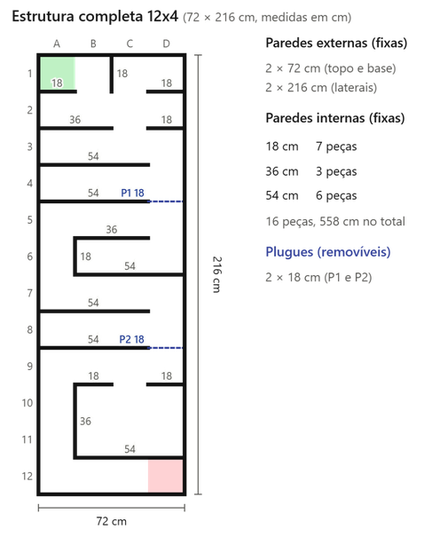
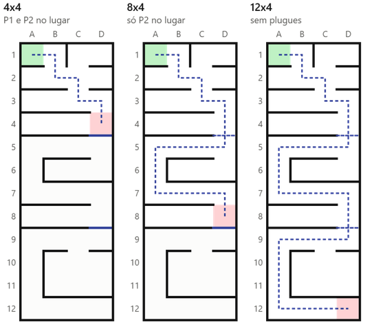
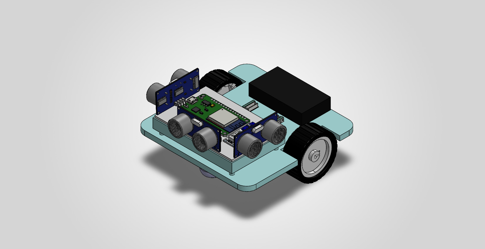
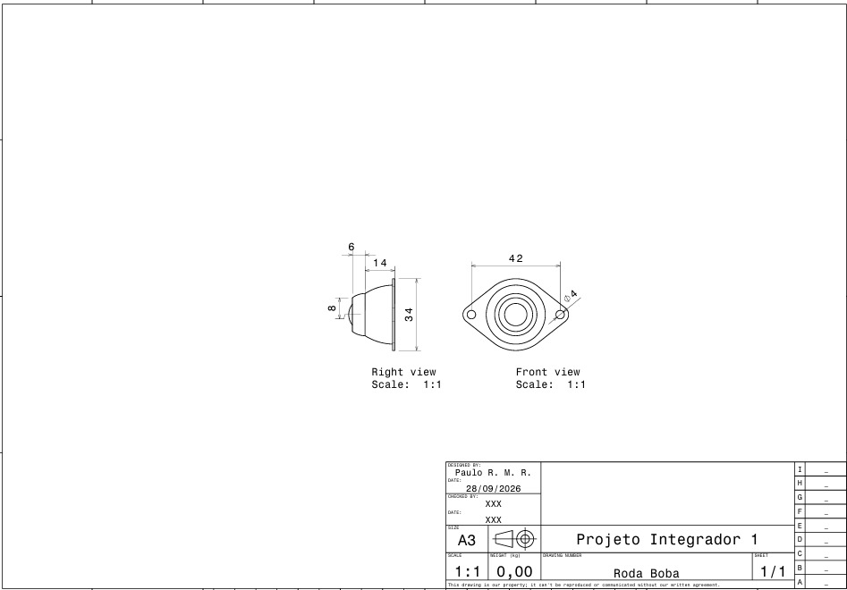
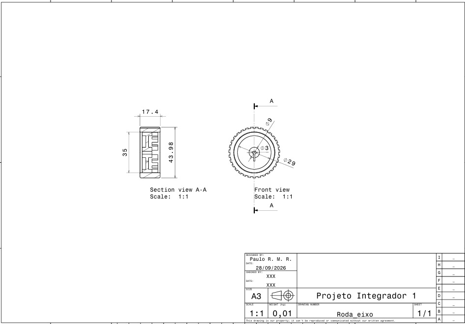
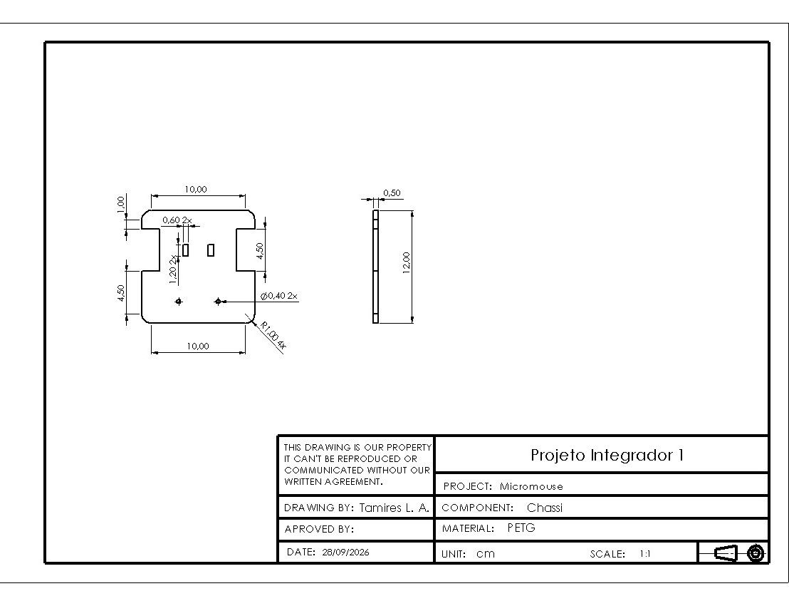
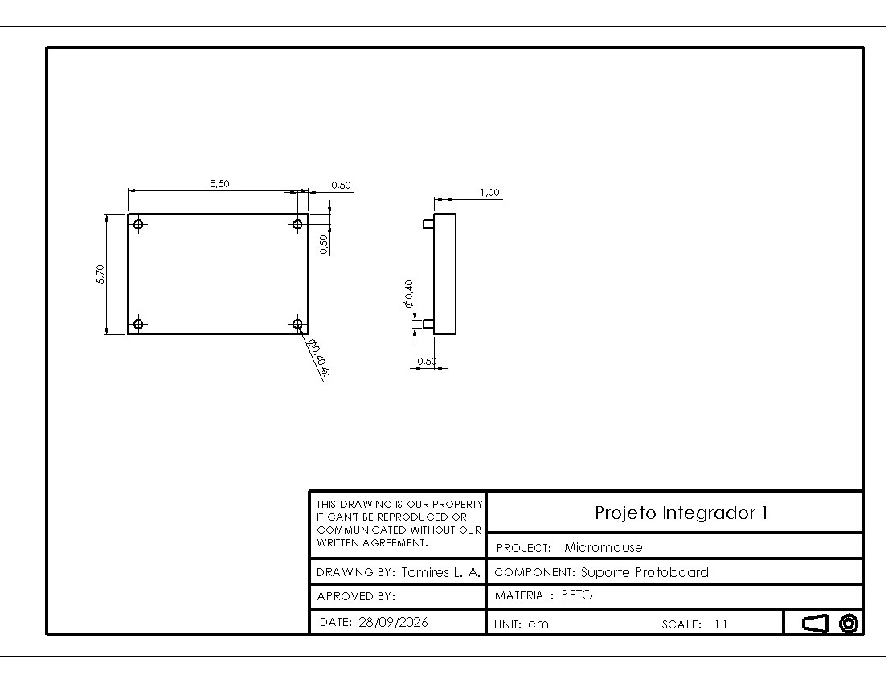

# Entrega do Projeto Conceitual de Estruturas

## 1. Labirinto de Teste

O labirinto de teste serve para validar o percurso do micromouse antes da competição.

### 1.1 Partes Fundamentais

O labirinto tem quatro partes. As paredes externas fecham toda a área do percurso. As paredes internas formam os obstáculos e corredores. A célula A1 é sempre o ponto de partida, e a célula de chegada muda conforme o tamanho do labirinto. Os plugues são peças removíveis que alteram o tamanho da estrutura sem precisar montar um labirinto novo.

### 1.2 Dimensões

Todas as células medem 18 cm de lado. O labirinto pequeno tem 4 colunas por 4 linhas, medindo 72 x 72 cm. O labirinto médio tem 4 colunas por 8 linhas, medindo 72 x 144 cm. O labirinto grande tem 4 colunas por 12 linhas, medindo 72 x 216 cm. A altura e a espessura das paredes ainda dependem do regulamento da competição.

### 1.3 Materiais: MDF

As paredes e a base do labirinto são feitas de MDF. O material foi escolhido por ser estável, fácil de cortar a laser ou em router CNC nas oficinas da universidade e por ter custo baixo. Suas superfícies planas também ajudam na leitura correta dos sensores do micromouse.

### 1.4 Explicação do Desenho

O desenho usa uma única estrutura modular, baseada no labirinto grande de 12 linhas. Os plugues encaixam nas linhas 4 e 8. Com os dois plugues, o labirinto vira a versão pequena. Com só o segundo plugue, vira a versão média. Sem plugues, fica na versão grande. Os obstáculos formam corredores, becos sem saída e câmaras falsas, sempre mantendo um caminho possível até a chegada.

### 1.5 Justificativa das Principais Decisões do Projeto

A estrutura modular foi escolhida no lugar de três estruturas independentes para reduzir material, tempo de montagem e espaço de armazenamento, permitindo testar todos os tamanhos exigidos com a mesma peça. Como o formato real do labirinto da prova não é divulgado antes da competição, essa flexibilidade permite alternar rapidamente entre tamanhos e simular percursos diferentes com o mesmo conjunto de peças. Os obstáculos foram definidos para exigir decisões do robô em situações distintas, como corredores estreitos, bifurcações e câmaras sem saída, aproximando o teste das condições reais da prova.

## 2. Micromouse

### 2.1 Partes Fundamentais

Montagem final do micromouse com todos os componentes integrados

#### 2.1.1 Rodas e Roda Boba

A roda boba mede 48,3 x 32,1 x 20 mm, com abertura de esfera de 15 mm e furos de fixação de 4 mm, com 39,2 mm entre centros, sendo feita de metal. As rodas eixo encaixam em eixo tipo D de 3 mm e são de borracha.

#### 2.1.2 Chassi

O chassi mede 12 x 12 cm, com recortes nas laterais para o encaixe das rodas e dois furos para a conexão do motor com o encoder. Os furos da parte frontal fixam a roda boba. O material é PETG impresso em 3D.

#### 2.1.3 Suporte da Protoboard

O suporte fixa a protoboard ao chassi. Ele tem pequenas colunas de elevação para não interferir na fixação da roda boba. O material também é PETG.

#### 2.1.4 Componentes Eletrônicos

Cada item traz a dimensão e o material.

- **Placa ESP32-S3 DevKitC-1 N8R2 (1 un.)**: 64 x 27 x 4,5 mm; PCB com módulo ESP32-S3-WROOM-1, blindagem metálica.
- **Ponte H ZS-H2 (1 un.)**: 28 x 28 mm; PCB.
- **Micromotor N20 com encoder, 6 V, 750 RPM (2 un.)**: 35 x 10 x 12 mm, eixo D de 3 mm; caixa de redução metálica.
- **Sensor ultrassônico HC-SR04 (4 un.)**: 45 x 20 x 15 mm; PCB com transdutores de carcaça metálica.
- **Bateria LiPo Tattu 650 mAh 2S (1 un.)**: 57 x 31 x 12 mm; células LiPo com invólucro termorretrátil.
- **Módulo step-down 3 A (2 un.)**: 22 x 17 x 4 mm; PCB.
- **Conversor de nível lógico 4 canais (1 un.)**: 15,2 x 12,5 mm; placa de fenolite.
- **Chave liga/desliga mini (1 un.)**: 15 x 10 x 10 mm, sem terminais; plástico com terminais metálicos.

### 2.2 Justificativa das Principais Decisões do Projeto

O tamanho máximo do micromouse foi definido em 12 x 12 cm. A roda boba foi escolhida no lugar de quatro rodas para garantir a manobrabilidade nas curvas dentro do labirinto, e a escolha da roda também permitiu prever e controlar a altura total do robô. O suporte da protoboard foi impresso em 3D, e os motores ficam abaixo do chassi para aproveitar melhor o espaço na parte superior da estrutura. Também foi feita uma prévia da distribuição dos componentes eletrônicos na protoboard.
