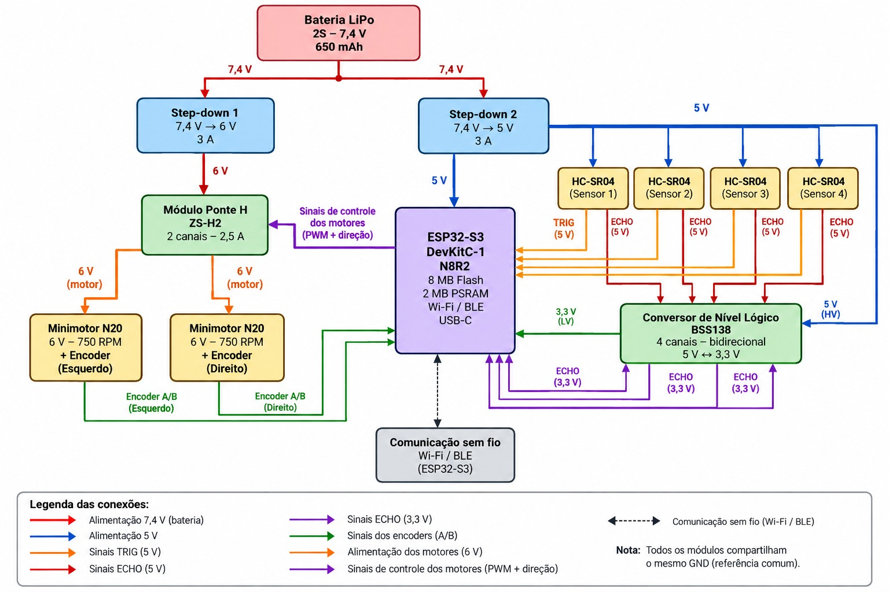
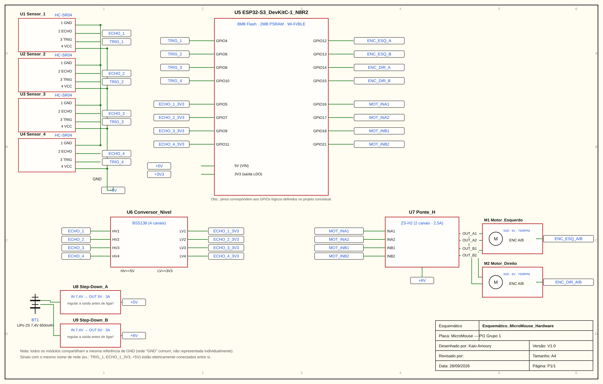

# 4.3 - Projeto Conceitual de Hardware

Este documento descreve a arquitetura eletrônica proposta para o MicroMouse, detalhando os principais subsistemas, as justificativas das escolhas de projeto, o fluxo de alimentação e o mapeamento das conexões entre os componentes.

O projeto foi elaborado de forma a permitir que o robô realize a navegação autônoma em um labirinto, utilizando sensores para identificação das paredes, encoders para acompanhamento da movimentação e dois motores controlados independentemente.

## 1. Subsistemas e Justificativas de Projeto

O hardware foi estruturado em quatro subsistemas principais: **energia, controle, atuação e percepção**.

### 1.1. Subsistema de Energia

O subsistema de energia é responsável por fornecer níveis adequados de tensão para os diferentes componentes do MicroMouse.

- **Bateria LiPo 2S 7,4 V 650 mAh:** utilizada como fonte principal de alimentação do sistema. A utilização de uma bateria LiPo permite fornecer energia ao robô em uma solução compacta e adequada para aplicações móveis.

- **2x Módulos Step-Down 3 A:** são utilizados dois conversores DC-DC independentes para gerar os níveis de tensão necessários aos diferentes subsistemas.

  - O **Step-Down 1** reduz a tensão da bateria para **5 V**, formando o barramento responsável pela alimentação do ESP32-S3, dos quatro sensores HC-SR04 e do lado de alta tensão do conversor de nível lógico.

  - O **Step-Down 2** reduz a tensão da bateria para **6 V**, formando o barramento utilizado pela ponte H ZS-H2 e pelos motores N20.

A separação dos barramentos de alimentação permite que o circuito de controle e sensoriamento seja alimentado independentemente do circuito responsável pelos motores, reduzindo a influência das variações de corrente geradas durante a movimentação do robô.

Além disso, a utilização do barramento regulado de 6 V evita que os motores sejam alimentados diretamente pela bateria LiPo, cuja tensão varia durante seu ciclo de carga e descarga.

### 1.2. Subsistema de Controle

O subsistema de controle é responsável pelo processamento dos dados dos sensores e pela geração dos comandos necessários para a movimentação do robô.

- **ESP32-S3 DevKitC-1 N8R2:** utilizado como unidade central de processamento do MicroMouse. A placa possui recursos computacionais suficientes para executar o algoritmo de navegação, realizar a leitura dos sensores ultrassônicos, processar os sinais dos encoders e controlar os motores.

  O microcontrolador também possui conectividade Wi-Fi e Bluetooth Low Energy (BLE), que poderá ser utilizada durante o desenvolvimento para telemetria, configuração e diagnóstico do sistema.

- **Conversor de Nível Lógico Bidirecional de 4 Canais BSS138:** utilizado para compatibilizar os sinais de saída `ECHO` dos sensores HC-SR04 com os níveis lógicos utilizados pelo ESP32-S3.

  Os sensores HC-SR04 são alimentados em 5 V e seus sinais `ECHO` podem atingir aproximadamente esse mesmo nível de tensão. Como os GPIOs do ESP32-S3 trabalham com lógica de 3,3 V, os sinais não devem ser conectados diretamente ao microcontrolador.

  O conversor possui quatro canais, permitindo realizar a adequação dos sinais provenientes dos quatro sensores utilizados no projeto.

### 1.3. Subsistema de Atuação

O subsistema de atuação é responsável pela movimentação do MicroMouse.

- **Ponte H ZS-H2 de 2 canais:** utilizada para realizar o acionamento independente dos dois motores. A ponte H recebe sinais de controle provenientes do ESP32-S3 e fornece a potência necessária para os motores.

  A utilização de dois canais permite controlar separadamente o motor esquerdo e o motor direito, possibilitando mudanças de velocidade e sentido de rotação.

- **2x Minimotores N20 6 V 750 RPM com Encoder:** utilizados para movimentar as rodas do robô. A configuração com dois motores independentes permite utilizar tração diferencial, possibilitando movimentos para frente, para trás e mudanças de direção.

  Os encoders acoplados aos motores disponibilizam dois canais, A e B, permitindo acompanhar a rotação das rodas. Essas informações poderão ser utilizadas para cálculo de velocidade, estimativa de deslocamento e implementação de técnicas de controle, como PID.

### 1.4. Subsistema de Percepção

O subsistema de percepção é responsável pela obtenção de informações sobre o ambiente ao redor do MicroMouse.

- **4x Sensores Ultrassônicos HC-SR04:** utilizados para realizar medições de distância entre o robô e as paredes do labirinto.

Cada sensor possui duas linhas principais de comunicação:

- `TRIG`: recebe do ESP32-S3 o comando para iniciar uma medição;
- `ECHO`: retorna um pulso cuja duração está relacionada à distância detectada.

Os sensores deverão ser acionados sequencialmente pelo software, evitando disparos simultâneos que possam provocar interferência entre as medições ultrassônicas.

A disposição física definitiva dos quatro sensores será definida considerando a geometria do robô e os testes realizados durante a construção do protótipo.

---

## 2. Diagrama de Blocos

A Figura 1 apresenta a arquitetura geral de hardware do MicroMouse, destacando os fluxos de alimentação, processamento, sensoriamento e atuação.

A bateria LiPo fornece energia aos dois conversores step-down. Um dos conversores gera o barramento de 5 V destinado à eletrônica de controle e sensoriamento, enquanto o segundo gera o barramento de 6 V utilizado pela ponte H e pelos motores.

O ESP32-S3 atua como unidade central do sistema, recebendo as informações provenientes dos sensores ultrassônicos e dos encoders e enviando comandos para a ponte H responsável pelo acionamento dos motores.

Os sinais `ECHO` dos sensores HC-SR04 passam pelo conversor de nível lógico BSS138 antes de serem recebidos pelo ESP32-S3.

> **Figura 1 - Diagrama de blocos da arquitetura de hardware do MicroMouse.**

## 3. Esquemático Elétrico e Mapeamento de Conexões

O esquemático elétrico apresenta as conexões necessárias entre os componentes do sistema, incluindo os barramentos de alimentação, os sinais dos sensores, os sinais dos encoders e as entradas de controle da ponte H.

Todos os componentes compartilham uma referência elétrica comum de GND.

> **Figura 2 - Esquemático elétrico conceitual do hardware do MicroMouse.**

As interconexões do sistema dividem-se em quatro fluxos principais:

1. **Alimentação:** a bateria LiPo 2S (7,4 V) alimenta dois reguladores step-down independentes — um entrega 5 V para o ESP32-S3 e os sensores, e o outro entrega 6 V para a ponte H e os motores, separando a linha lógica da linha de potência.
2. **Sensoriamento:** 4 sensores ultrassônicos HC-SR04, um em cada direção, recebem o pulso `TRIG` do ESP32-S3 e retornam o tempo de eco (`ECHO`), usados para detectar as paredes do labirinto.
3. **Conversão de Nível:** como os pinos `ECHO` operam em 5 V e o ESP32-S3 trabalha em 3,3 V, um conversor de nível lógico BSS138 (4 canais) faz a adaptação de tensão nesses sinais antes de chegarem ao microcontrolador.
4. **Controle e Atuação:** o ESP32-S3 processa os dados dos sensores e comanda a ponte H ZS-H2, que aciona os dois motores N20 de forma independente (tração diferencial), enquanto os encoders de cada motor retornam pulsos de quadratura para odometria.

### 3.1. Roteamento de Alimentação

A alimentação do circuito é organizada em três níveis principais: 7,4 V, 6 V, 5 V e 3,3 V.

#### Bateria

A bateria LiPo 2S fornece aproximadamente 7,4 V nominais para as entradas dos dois conversores step-down.

- Terminal positivo da bateria → entrada positiva dos dois step-downs;
- Terminal negativo da bateria → GND comum do circuito.

#### Barramento de 5 V

O barramento de 5 V é gerado por um dos módulos step-down e é utilizado para alimentar:

- pino `5V` do ESP32-S3 DevKitC-1;
- pinos `VCC` dos quatro sensores HC-SR04;
- pino `HV` do conversor de nível lógico BSS138.

#### Barramento de 6 V

O segundo módulo step-down fornece aproximadamente 6 V para o subsistema de atuação.

O barramento é conectado à entrada de potência da ponte H ZS-H2, que posteriormente fornece a alimentação aos motores N20.

#### Barramento de 3,3 V

O ESP32-S3 disponibiliza uma saída regulada de 3,3 V.

Essa tensão é utilizada para:

- pino `LV` do conversor de nível lógico BSS138;
- alimentação dos encoders, caso o modelo efetivamente adquirido seja compatível com 3,3 V.

A compatibilidade elétrica dos encoders deverá ser confirmada antes da montagem definitiva.

#### GND Comum

Os seguintes componentes devem compartilhar a mesma referência de GND:

- bateria;
- Step-Down 1;
- Step-Down 2;
- ESP32-S3;
- ponte H ZS-H2;
- quatro sensores HC-SR04;
- conversor BSS138;
- dois encoders.

---

### 3.2. Roteamento dos Sensores Ultrassônicos

Cada sensor HC-SR04 possui os seguintes terminais:

- `VCC`;
- `GND`;
- `TRIG`;
- `ECHO`.

Os quatro sensores são alimentados pelo barramento de 5 V.

Os sinais `TRIG` são enviados diretamente pelo ESP32-S3 aos sensores.

Os sinais `ECHO` passam pelo conversor de nível lógico BSS138 antes de chegarem ao ESP32-S3.

O mapeamento definido é apresentado abaixo:

| Sensor | TRIG | ECHO no ESP32-S3 |
|---|---|---|
| HC-SR04 1 | GPIO4 | GPIO5 |
| HC-SR04 2 | GPIO6 | GPIO7 |
| HC-SR04 3 | GPIO8 | GPIO9 |
| HC-SR04 4 | GPIO10 | GPIO11 |

No conversor de nível lógico, as conexões dos sinais `ECHO` são:

| Sensor | Lado 5 V | Lado 3,3 V |
|---|---|---|
| HC-SR04 1 | HV1 | LV1 |
| HC-SR04 2 | HV2 | LV2 |
| HC-SR04 3 | HV3 | LV3 |
| HC-SR04 4 | HV4 | LV4 |

Dessa forma, o caminho do primeiro sensor, por exemplo, é:

`ECHO HC-SR04 1 → HV1 → LV1 → GPIO5`

O mesmo princípio é utilizado para os demais sensores.

A utilização do módulo BSS138 para os pulsos `ECHO` deverá ser validada experimentalmente durante a montagem do protótipo.

---

### 3.3. Roteamento dos Motores

Os dois motores são alimentados e controlados por meio da ponte H ZS-H2.

As saídas do canal A da ponte H são conectadas ao motor esquerdo, enquanto as saídas do canal B são conectadas ao motor direito.

O ESP32-S3 controla a ponte H utilizando quatro GPIOs:

| Entrada ZS-H2 | GPIO ESP32-S3 |
|---|---|
| INA1 | GPIO16 |
| INA2 | GPIO17 |
| INB1 | GPIO18 |
| INB2 | GPIO21 |

Esses sinais permitem definir o sentido de rotação dos motores e aplicar modulação PWM para controle de velocidade.

A alimentação de potência da ponte H é realizada pelo barramento regulado de 6 V.

---

### 3.4. Roteamento dos Encoders

Cada motor possui um encoder com dois canais de saída, denominados A e B.

Esses sinais são conectados ao ESP32-S3 para permitir a leitura da rotação das rodas.

O mapeamento proposto é:

| Encoder | Canal | GPIO ESP32-S3 |
|---|---|---|
| Esquerdo | A | GPIO12 |
| Esquerdo | B | GPIO13 |
| Direito | A | GPIO14 |
| Direito | B | GPIO15 |

Os sinais dos encoders poderão ser processados utilizando interrupções no microcontrolador, permitindo acompanhar a quantidade e a direção dos pulsos gerados durante a movimentação.

A necessidade de resistores de pull-up e o nível de tensão utilizado para alimentação dos encoders dependerão das características elétricas do modelo adquirido e deverão ser confirmados antes da montagem definitiva.

---

## 4. Tabela Consolidada de Pinagem

A tabela a seguir apresenta o mapeamento dos GPIOs utilizados no ESP32-S3.

| GPIO | Função |
|---|---|
| GPIO4 | TRIG do HC-SR04 1 |
| GPIO5 | ECHO do HC-SR04 1 após conversão de nível |
| GPIO6 | TRIG do HC-SR04 2 |
| GPIO7 | ECHO do HC-SR04 2 após conversão de nível |
| GPIO8 | TRIG do HC-SR04 3 |
| GPIO9 | ECHO do HC-SR04 3 após conversão de nível |
| GPIO10 | TRIG do HC-SR04 4 |
| GPIO11 | ECHO do HC-SR04 4 após conversão de nível |
| GPIO12 | Canal A do encoder esquerdo |
| GPIO13 | Canal B do encoder esquerdo |
| GPIO14 | Canal A do encoder direito |
| GPIO15 | Canal B do encoder direito |
| GPIO16 | INA1 da ponte H ZS-H2 |
| GPIO17 | INA2 da ponte H ZS-H2 |
| GPIO18 | INB1 da ponte H ZS-H2 |
| GPIO21 | INB2 da ponte H ZS-H2 |

---

## 5. Componentes Utilizados

| Quantidade | Componente | Especificação |
|---:|---|---|
| 1 | ESP32-S3 DevKitC-1 N8R2 | 8 MB Flash, 2 MB PSRAM, Wi-Fi e BLE |
| 4 | Sensor HC-SR04 | Sensor ultrassônico de distância |
| 2 | Minimotor N20 com encoder | 6 V, 750 RPM |
| 1 | Ponte H ZS-H2 | 2 canais, 2,5 A |
| 1 | Bateria LiPo | 2S, 7,4 V, 650 mAh |
| 2 | Módulo Step-Down | Conversor DC-DC, 3 A |
| 1 | Conversor de nível lógico BSS138 | 4 canais, 5 V ↔ 3,3 V |

---

## 6. Cuidados de Montagem e Validação

Antes da montagem definitiva do circuito, algumas verificações devem ser realizadas para evitar danos aos componentes e garantir o funcionamento adequado do sistema.

1. Os dois módulos step-down devem ter suas tensões de saída ajustadas e verificadas utilizando um multímetro antes da conexão aos demais componentes.

2. O barramento destinado à eletrônica deverá apresentar aproximadamente **5 V**, enquanto o barramento destinado à ponte H deverá apresentar aproximadamente **6 V**.

3. Todos os componentes do sistema devem compartilhar a mesma referência de **GND**.

4. Os sinais `ECHO` de 5 V provenientes dos sensores HC-SR04 não devem ser conectados diretamente aos GPIOs do ESP32-S3.

5. A compatibilidade do conversor BSS138 com os pulsos `ECHO` dos sensores HC-SR04 deverá ser validada experimentalmente.

6. A tensão de alimentação e o tipo de saída elétrica dos encoders devem ser confirmados de acordo com o modelo efetivamente adquirido.

7. Os quatro sensores ultrassônicos devem ser acionados sequencialmente pelo software para reduzir possíveis interferências entre as medições.

8. As tensões e polaridades devem ser verificadas antes da energização do circuito.

9. Durante os testes, deve-se observar se os conversores step-down e a ponte H suportam adequadamente as correntes exigidas pelos motores, especialmente durante partidas, frenagens e mudanças de sentido.

Com essa arquitetura, o sistema proposto integra alimentação, controle, percepção e atuação em uma estrutura modular, permitindo o desenvolvimento e a posterior validação experimental do MicroMouse.
