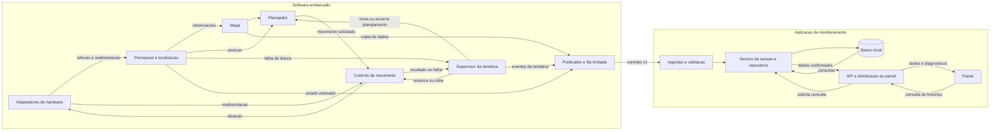
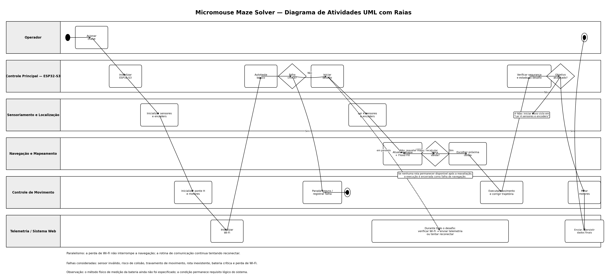
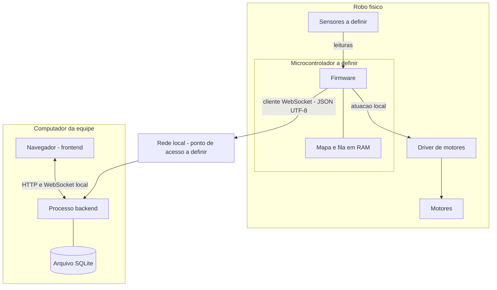
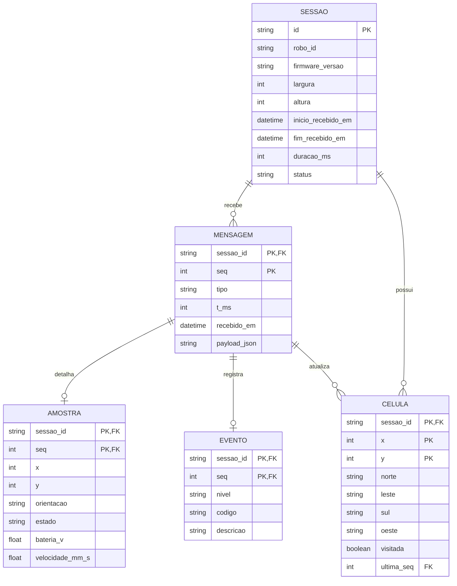

# Projeto conceitual de software

## Sumário

- [Escopo e arquitetura](#escopo-e-arquitetura)
- [Testes de arquitetura e integração](#testes-de-arquitetura-e-integracao)
- [Dados e implementação](#dados-e-implementacao)
- [Testes de dados e qualidade](#testes-de-dados-e-qualidade)
- [Backlog do produto](#backlog-do-produto)

---

## Escopo e arquitetura

### 1. Propósito e limites do software

O software deve permitir que o Micromouse perceba o labirinto, mantenha uma representação do ambiente e de sua posição, escolha movimentos e controle sua execução de forma autônoma. A telemetria oferece à equipe uma forma de observar o robô e analisar os dados recebidos durante as tentativas.

#### 1.1 Escopo proposto

| Parte | Responsabilidade incluída | Limite |
| --- | --- | --- |
| Aquisição | Receber leituras, identificar validade e disponibilizar observações ao controle | Seleção, ligação elétrica e calibração física exigem participação de hardware |
| Localização e mapa | Estimar célula e orientação e registrar paredes observadas | Não pressupõe mapa completo nem localização perfeita |
| Navegação | Selecionar movimentos com base no mapa e objetivo configurado | Algoritmo e critério de chegada dependem das regras do desafio |
| Controle | Executar movimentos e responder a falhas locais | Não depende de processamento no computador; limites e períodos serão definidos com hardware |
| Gestão da tentativa | Coordenar inicialização, execução, término e identificação da sessão | Estados e transições definidos pelo supervisor da tentativa |
| Telemetria | Emitir observações e eventos sem bloquear o controle | Perdas são possíveis; não se promete histórico integral durante desconexões |
| Backend | Validar, persistir e disponibilizar os dados recebidos | Não decide trajetórias nem aciona os motores |
| Interface | Exibir mapa, estado, métricas disponíveis e histórico | Apresentação de dados e estados de conexão |

Nesta proposta inicial ficam fora do escopo: direção remota pelo dashboard, controle dependente de nuvem, operação simultânea de vários robôs e garantia de menor caminho antes de explorar o ambiente. Se uma dessas capacidades for exigida, será necessário atualizar requisitos, arquitetura e testes. Iniciar uma tentativa localmente é uma interface abstrata; botão, chave ou outro mecanismo dependem do hardware e do regulamento.

#### 1.2 Capacidades do sistema

| Código provisório | Capacidade | Componentes envolvidos |
| --- | --- | --- |
| CAP-G01 | Integrar percepção, localização, planejamento e controle no robô | Percepção, supervisor, controle e hardware |
| CAP-G02 | Observar a execução sem tornar a navegação dependente da rede | Firmware, backend e painel |
| CAP-G03 | Manter a tentativa coerente na conexão, desconexão e reinicialização | Supervisor, comunicação e backend |
| CAP-G04 | Tratar falhas locais e impedir acionamento indevido na inicialização | Percepção, supervisor, controle e hardware |

### 2. Alternativas e decisões arquiteturais

| Decisão | Alternativas consideradas | Proposta e justificativa | Consequência / validação necessária |
| --- | --- | --- | --- |
| Local do controle | Decisão no computador ou no robô | Controle e navegação no robô, preservando autonomia sem comunicação | Placa deve comportar mapa, controle e aquisição; avaliar RAM e tempo de execução |
| Organização embarcada | Rotina única ou módulos separados | Módulos com interfaces explícitas para aquisição, mapa, planejamento, controle e telemetria | Evitar trabalho de rede no ciclo crítico; tarefas e prioridades serão definidas na visão de processos |
| Backend | Microsserviços ou serviço único modular | Serviço único com transporte, validação, serviços e persistência separados | Permite testar os limites sem implantar vários processos de negócio; falha do serviço interrompe monitoramento, não navegação |
| Interface | Acoplada ao firmware ou aplicação no computador | Frontend separado que consulta o backend | Robô não precisa servir telas; painel deve indicar indisponibilidade do backend |
| Comunicação | WebSocket em rede local ou adaptador serial | WebSocket/JSON como transporte proposto | Se a placa não suportar a rede escolhida, estudar ponte serial; não considerá-la implementada ou intercambiável sem testes |
| Persistência | Banco no computador ou armazenamento completo embarcado | Banco local no computador; mapa de trabalho no robô | Histórico contém apenas dados recebidos; persistência embarcada entre reinícios segue pendente |

O padrão geral combina firmware modular em camadas com uma aplicação cliente-servidor no computador. O backend é um monólito modular. As tecnologias propostas dependem de validação de compatibilidade com o hardware e a aplicação de telemetria.

### 3. Visão lógica

#### 3.1 Módulos e responsabilidades

| Módulo | Recebe | Produz / responsabilidade |
| --- | --- | --- |
| Adaptadores de hardware | Sinais de sensores e comandos de atuação | Leituras com unidade, validade e instante; acesso ao driver de motor |
| Percepção e localização | Leituras válidas e movimento observado | Observações de paredes, posição e orientação estimadas |
| Mapa | Observações e posição | Grade com estados desconhecido, livre e parede, conforme contrato de dados |
| Planejador | Mapa, posição e objetivo | Solicitação de movimento; não escreve diretamente nas saídas do motor |
| Controle de movimento | Solicitação e realimentação disponível | Comandos aos atuadores e resultado: concluído, em execução ou falha |
| Supervisor da tentativa | Solicitação local, resultado de movimento e falhas | Autoriza/inibe movimento, coordena tentativa e gera eventos de início e fim |
| Publicador de telemetria | Cópias coerentes de estado, mapa e eventos | Mensagens versionadas em fila limitada, sem bloquear os produtores |
| Ingestão e validação | Mensagens do robô | Mensagens aceitas ou diagnóstico de rejeição |
| Serviço de sessão e repositório | Mensagens aceitas e consultas | Transações no banco, projeções atuais e histórico |
| API e distribuição ao painel | Consultas e dados confirmados | Respostas HTTP e atualizações WebSocket |
| Painel | Respostas, atualizações e estado de conexão | Visualização da execução e do histórico |

#### 3.2 Diagrama de módulos

O diagrama representa dependências e intercâmbio de informação; não substitui o diagrama de atividades UML nem especifica threads.



#### 3.3 Regras entre módulos

1. O controle é o único módulo que solicita atuação aos adaptadores de motor. O supervisor pode inibir essa atuação; o painel não possui essa permissão.
2. O planejador só solicita movimentos compatíveis com as observações disponíveis. Uma leitura inválida não pode ser convertida em caminho livre. A política de exploração de direções desconhecidas será explicitada na especificação de navegação.
3. O mapa de navegação pertence ao firmware. O mapa no backend é uma projeção das mensagens recebidas, podendo estar incompleto ou atrasado.
4. Dados destinados à telemetria são copiados de forma coerente. O transporte não mantém bloqueios do mapa ou do controle enquanto aguarda a rede. O mecanismo de sincronização depende do ambiente embarcado.
5. O backend publica como persistidos somente dados cuja transação foi confirmada. Erros de gravação e de comunicação são estados explícitos da aplicação.
6. Nenhuma falha do painel ou do backend é interpretada pelo robô como instrução de movimento ou prova de chegada.

#### 3.4 Visão de processos e diagrama de atividades UML

##### 3.4.1 Diagrama de atividades UML com raias

O diagrama abaixo representa o fluxo operacional do Micromouse desde a inicialização até o encerramento da tentativa. As raias separam as responsabilidades entre **Operador**, **Controle Principal (ESP32-S3)**, **Sensoriamento e Localização**, **Navegação e Mapeamento**, **Controle de Movimento** e **Telemetria / Sistema Web**.



##### 3.4.2 Explicação do fluxo

O processo começa quando o operador aciona a chave liga/desliga. A **ESP32-S3** inicializa os módulos internos, os quatro sensores ultrassônicos **HC-SR04**, os encoders dos dois motores N20, a ponte H e a comunicação Wi-Fi. Em seguida, o sistema executa uma verificação inicial. Se houver uma falha crítica que impeça a operação segura, os motores permanecem inibidos e a tentativa não é iniciada.

Durante a exploração, os sensores ultrassônicos posicionados **à frente, atrás, à esquerda e à direita** identificam paredes e caminhos disponíveis. As leituras são associadas à posição e à orientação estimadas a partir dos encoders e utilizadas para atualizar o mapa interno do labirinto.

Com o mapa atualizado, o módulo de navegação executa o algoritmo **Flood Fill**. O algoritmo atribui custos às células em relação à área objetivo e seleciona, entre as células acessíveis, uma vizinha de menor custo. Sempre que uma nova parede altera o caminho conhecido, o mapa é atualizado e o Flood Fill é recalculado antes da próxima decisão de movimento.

A decisão de navegação é convertida em comandos de movimento. A ESP32-S3 aciona os motores por meio da ponte H, enquanto os encoders fornecem realimentação para verificar o deslocamento e auxiliar na correção da trajetória. Em caso de risco de colisão, o movimento é interrompido para correção de posicionamento. Falhas críticas de movimento ou a inexistência de uma rota válida após a reavaliação do mapa levam à parada segura da tentativa.

A **telemetria é executada em paralelo à navegação**. A ESP32-S3 utiliza o Wi-Fi para transmitir o estado da tentativa, posição, mapa observado e métricas disponíveis. A perda de Wi-Fi não interrompe a resolução do labirinto: o robô continua operando localmente e tenta restabelecer a conexão em paralelo. Assim, o controle do Micromouse não depende do backend ou do painel para tomar decisões de movimento.

O ciclo **sensoriamento → localização → atualização do mapa → Flood Fill → decisão → movimento** se repete até que a célula objetivo seja alcançada. Na chegada, os motores são parados, a tentativa é marcada como concluída, as métricas finais são consolidadas e os dados disponíveis são enviados ao sistema de monitoramento e persistência.

As principais decisões representadas no fluxo são: validação da inicialização, validade das leituras, existência de rota, conclusão do movimento, risco de colisão ou falha de atuação, disponibilidade da comunicação e chegada ao objetivo. As atividades de sensoriamento, leitura dos encoders e telemetria podem ocorrer de forma concorrente, desde que a comunicação não bloqueie o ciclo de controle.

##### 3.4.3 Visão de processos

A visão de processos organiza o funcionamento do sistema em nove processos principais, relacionando suas entradas, atividades e saídas.

| Processo | Entrada | Atividades principais | Saída |
| --- | --- | --- | --- |
| **P1 – Inicialização** | Alimentação e acionamento da chave | Inicializar ESP32-S3, sensores, encoders, controle dos motores e comunicação; executar verificações iniciais | Sistema pronto ou estado seguro de falha |
| **P2 – Sensoriamento** | Ambiente ao redor do robô | Ler os quatro HC-SR04 e validar as medições | Paredes e caminhos observados |
| **P3 – Localização** | Pulsos dos encoders e estado anterior | Estimar deslocamento, célula atual e orientação | Posição e orientação atualizadas |
| **P4 – Mapeamento** | Paredes observadas e posição atual | Atualizar células, paredes e regiões visitadas | Mapa interno atualizado |
| **P5 – Planejamento de rota** | Mapa, posição e objetivo | Executar Flood Fill e selecionar uma célula vizinha acessível | Próximo movimento planejado |
| **P6 – Controle de movimento** | Movimento planejado | Acionar a ponte H, controlar os motores e acompanhar os encoders | Movimento concluído ou falha identificada |
| **P7 – Telemetria** | Estado, mapa e métricas disponíveis | Transmitir dados por Wi-Fi sem bloquear o controle; tentar reconectar quando necessário | Dados disponíveis no sistema de monitoramento |
| **P8 – Tratamento de falhas** | Leituras inválidas, risco de colisão, falha de movimento, rota inválida ou perda de comunicação | Detectar o evento e aplicar a reação correspondente | Continuação controlada, reconexão ou parada segura |
| **P9 – Encerramento** | Objetivo alcançado ou condição de término | Parar motores, consolidar métricas e registrar o resultado | Tentativa finalizada e dados finais disponíveis |

O fluxo principal pode ser resumido como **P1 → P2/P3 → P4 → P5 → P6**, retornando a **P2/P3** enquanto o objetivo não for alcançado. O **P7** ocorre em paralelo e não bloqueia a navegação. O **P8** pode ser acionado a partir de diferentes etapas. Ao atingir o objetivo ou uma condição definitiva de término, o fluxo segue para **P9**.

### 4. Interfaces com hardware

Esta tabela é uma proposta de acordo entre equipes. Não equivale a pinagem, esquemático ou confirmação de componentes. A seleção de barramentos, níveis elétricos e drivers permanece com hardware em conjunto com software.

| Interface | Informação / comando esperado | Comportamento exigido na integração | Pendente com hardware |
| --- | --- | --- | --- |
| Sensores de parede | Leitura, unidade, orientação física, validade e instante | Distinguir ausência de parede de falha ou timeout | Tipo, quantidade, alcance útil, interferência e tempo de leitura |
| Realimentação de movimento | Deslocamento e/ou orientação medidos, quando disponíveis | Manter convenção de sinais e registrar qualidade da estimativa | Encoders, IMU ou alternativa; resolução e calibração |
| Driver de motor | Solicitação de atuação e inibição | Partida com atuação inibida; parada testada conforme comportamento real do driver | Pinagem, polaridade, frenagem versus roda livre e estado no reset |
| Comando local de execução | Evento de iniciar/interromper, conforme regras | Evitar início por evento espúrio; retorno de rede não inicia movimento | Botão ou outro dispositivo, tratamento de sinal e regulamento |
| Medição de alimentação | Tensão e validade, se existir medição | Campo indisponível permanece `null`; limiares dependem do circuito | Circuito de medição, faixa e critérios de bateria baixa |
| Comunicação | Enlace compatível com transporte escolhido | Reconexão independente do ciclo de controle | Interface de rede, antena/adaptador e memória necessária |

Antes da integração física, as equipes devem registrar: componente, unidade, conector/pino, limite elétrico, intervalo válido, tempo máximo de resposta e comportamento em falha. O software não deve assumir que PWM zero sempre causa frenagem ou que um reset desenergiza a tração. Esses comportamentos precisam ser estabelecidos para o driver escolhido e verificados em bancada.

Propõe-se que falhas de leitura indispensável à navegação inibam novos movimentos e acionem a parada definida com hardware. Prazo de detecção, distância de parada e estratégia de recuperação estão pendentes; sem esses parâmetros o teste físico correspondente não pode ser aprovado.

### 5. Visão de implantação

#### 5.1 Nós e artefatos

| Nó | Artefatos executados / armazenados | Relações |
| --- | --- | --- |
| Microcontrolador no robô | Firmware com aquisição, navegação, controle, supervisor e telemetria; mapa de trabalho em RAM | Sensores e driver; conexão iniciada para o backend |
| Rede local | Enlace entre robô e computador, por ponto de acesso a definir | Não requer internet para a operação proposta |
| Computador da equipe | Processo do backend, arquivo SQLite e navegador com frontend | Backend recebe robô; navegador consulta backend |
| Periféricos do robô | Sensores, driver e atuadores definidos por hardware | Não hospedam frontend ou banco de histórico nesta proposta |

#### 5.2 Diagrama de implantação conceitual



As setas de telemetria representam o fluxo de dados de aplicação; a conexão WebSocket também possui tráfego de protocolo no sentido inverso. O frontend não recebe acesso direto ao driver de motor ou ao SQLite.

#### 5.3 Inicialização e recuperação

- **Operação conectada:** configurar endereço do backend e rede, iniciar o serviço e abrir o painel. Inicializar o robô com motores inibidos; validar entradas e configuração antes de aceitar o início local da tentativa.
- **Operação sem computador:** a tentativa pode executar autonomamente se as condições locais forem válidas. O monitoramento e a gravação remota ficam indisponíveis, sem garantia de recuperação integral posterior.
- **Perda de rede:** continuar a lógica local, respeitando suas próprias condições de segurança; limitar a fila e contabilizar perdas conforme o contrato de mensagens.
- **Retorno de rede:** repetir `sessao_inicio` com o mesmo UUID e metadados, reenviar o mapa atual em lotes e o estado disponível. Uma reconexão não gera nova tentativa nem apaga histórico.
- **Reinício do backend:** recuperar transações confirmadas; manter resultado indeterminado quando não houver encerramento confirmado. Reconciliar mensagens recebidas após reconexão sem duplicação.
- **Reinício do robô:** inibir atuação e criar outro UUID para a próxima tentativa. Não continuar automaticamente um trajeto apenas porque a rede voltou. Sem persistência embarcada aprovada, não se garante recuperar o mapa anterior.

### 6. Restrições e pontos técnicos em aberto

- A fila proposta de 20 mensagens de até 4.096 bytes pode ocupar 81.920 bytes de conteúdo, além das estruturas e dos buffers. O limite precisa ser validado na placa escolhida.
- O contrato v1 não define marcador ou contagem para confirmar o recebimento de todos os lotes de mapa. Até definir esse mecanismo, a interface deve apresentar o mapa como observado ou parcial.
- O contador de descarte deve permanecer disponível na instrumentação local. Sua transmissão exige um evento definido ou extensão versionada do contrato.
- O resultado de uma sessão deve ser distinguido do estado da conexão. Propõe-se restaurar `em_andamento` ao receber evidência nova de execução da mesma sessão sem encerramento, sem reverter resultados finais confirmados.

---

<a id="testes-de-arquitetura-e-integracao"></a>

## Testes de arquitetura e integração

Roteiros planejados para verificar as interfaces entre os componentes.

### Preparação

Registrar versões, hardware ou simulador, configurações, condição inicial, massa de dados, passos e resultados. Utilizar banco de teste separado. Começar com atuadores simulados; ensaios físicos de falha exigem bancada com rodas suspensas e comportamento de parada previamente acordado com hardware. Os limites de tempo de controle dependem da definição do hardware.

#### CT-G01 — Fluxo integrado de uma tentativa conectada

- **Rastreabilidade:** CAP-G01, CAP-G02, CAP-P01 a CAP-P03; complementa CT-P01 e CT-P05.
- **Objetivo:** verificar a cadeia percepção → mapa → decisão → controle e sua observação no painel.
- **Pré-condições:** módulos integrados, backend e painel disponíveis, cenário sintético conhecido, objetivo e estado inicial configurados.
- **Procedimento:** iniciar uma tentativa; fornecer leituras e realimentação determinísticas que representem avanço e mudança de orientação; registrar a solicitação do planejador, atuação e resultado de cada movimento; receber telemetria e consultar mapa e sessão; gerar encerramento válido.
- **Resultado esperado:** movimento passa pelo controle e pelo supervisor, sem comando direto do painel; posição e paredes recebidas correspondem aos dados do cenário; banco e painel usam o mesmo UUID; somente `sessao_fim` válido confirma o resultado final. Não se exige mapa completo se parte do cenário não foi observada.

#### CT-G02 — Execução sem backend ou painel

- **Rastreabilidade:** CAP-G01, CAP-G02; RNF-P04.
- **Objetivo:** comprovar a independência funcional do controle em relação ao computador.
- **Pré-condições:** simulador de entradas e atuadores ou bancada preparada; período de controle aprovado e instrumentação de espera de rede.
- **Procedimento:** executar o mesmo cenário com computador conectado e depois com backend desligado desde o início; comparar decisões sob as mesmas entradas; observar fila e ciclos de controle até terminar a tentativa.
- **Resultado esperado:** as decisões de navegação são as mesmas para as mesmas entradas; não há espera de confirmação remota no controle; fila permanece limitada; ausência de histórico remoto é explicitada, sem ser apresentada como falha de navegação ou sucesso de persistência.

#### CT-G03 — Perda e recuperação da comunicação

- **Rastreabilidade:** CAP-G02, CAP-G03, CAP-P04; RNF-P04 e RNF-P05; complementa CT-P02, CT-P06 e CT-P07.
- **Objetivo:** validar a recuperação entre firmware, serviço e painel sem criar outra tentativa.
- **Pré-condições:** sessão conectada com UUID conhecido e pelo menos uma célula persistida.
- **Procedimento:** interromper enlace por 30 s durante uma execução de bancada; produzir novas observações; verificar indicação visual após a última amostra; restaurar enlace; reenviar início e lotes atuais; consultar registros e comparar células recebidas.
- **Resultado esperado:** mesma sessão após reconexão, sem registros duplicados; painel indica dados desatualizados em até 2 s; navegação permanece sujeita apenas às condições locais; mapa é atualizado conforme lotes válidos e lacunas permanecem identificáveis. Sem marcador de sincronização definido, a interface não declara mapa integralmente sincronizado.

#### CT-G04 — Falha do armazenamento no computador

- **Rastreabilidade:** CAP-G02, CAP-P02, CAP-P04; complementa CT-P03.
- **Objetivo:** impedir que falha de persistência seja confundida com gravação bem-sucedida ou interfira nos motores.
- **Pré-condições:** sessão em andamento e falha controlável no repositório de dados, sem afetar arquivos reais.
- **Procedimento:** induzir erro de gravação em uma transação; observar serviço, painel e firmware; remover a falha e enviar uma mensagem inédita válida.
- **Resultado esperado:** transação afetada não produz projeção parcial nem publicação como dado confirmado; painel recebe indicação de erro de armazenamento; firmware continua sem esperar o banco; nova mensagem é persistida após recuperação. Amostra perdida não reaparece sem reenvio explícito.

#### CT-G05 — Reinício do robô durante uma tentativa

- **Rastreabilidade:** CAP-G03, CAP-G04, CAP-P02.
- **Objetivo:** impedir mistura de tentativas e retomada involuntária de movimento.
- **Pré-condições:** tentativa ativa em ambiente simulado ou bancada; configuração inicial válida.
- **Procedimento:** reiniciar o firmware sem mensagem de encerramento; observar saídas durante inicialização; aguardar indicação de perda de dados da sessão anterior; iniciar localmente outra tentativa e receber suas mensagens.
- **Resultado esperado:** atuação inicialmente inibida; não há retomada por reconexão; novo UUID para nova tentativa; sessão anterior não recebe sucesso presumido e mantém resultado indeterminado se não houver encerramento confirmado. Dados anteriores permanecem separados dos novos.

#### CT-G06 — Falha de uma leitura indispensável

- **Rastreabilidade:** CAP-G01, CAP-G04.
- **Objetivo:** verificar propagação da falha entre adaptador, percepção, supervisor e controle.
- **Pré-condições:** política de leitura válida, timeout e parada definida com hardware; atuadores simulados antes de qualquer ensaio físico. Se os limites não estiverem definidos, registrar caso como bloqueado, não aprovado.
- **Procedimento:** fornecer leituras válidas e iniciar movimento de teste; injetar timeout ou leitura inválida em sensor indispensável; observar decisões, solicitação de parada e evento; restabelecer leitura sem novo comando local.
- **Resultado esperado:** leitura inválida não vira caminho livre; supervisor inibe novos movimentos e controle executa parada conforme critérios aprovados; recuperação não causa retomada automática sem a política explícita de rearme. Registrar tempo observado e comparar ao limite definido com hardware.

#### CT-G07 — Reinício do backend e encerramento tardio

- **Rastreabilidade:** CAP-G03, CAP-P02, CAP-P04; RNF-P01 e RNF-P02.
- **Objetivo:** reconciliar a mesma tentativa após indisponibilidade do serviço.
- **Pré-condições:** sessão persistida, robô em execução e banco de teste íntegro.
- **Procedimento:** desligar o processo backend; finalizar a tentativa no firmware enquanto o serviço está indisponível; reiniciar serviço; reconectar com mesmo UUID, início repetido e encerramento retido; repetir o encerramento idêntico.
- **Resultado esperado:** dados confirmados anteriormente são recuperados; o resultado só se torna final ao receber encerramento válido; repetição não duplica mensagem nem sessão. Se houver reset do robô antes do reenvio e não existir persistência embarcada, o resultado permanece indeterminado em vez de ser inventado.

### Registro dos resultados

Para cada caso registrar: data, executor, revisão do código, ambiente, resultado esperado, resultado observado, evidência e situação (`não executado`, `bloqueado`, `aprovado` ou `reprovado`).

---

<a id="dados-e-implementacao"></a>

## Dados e implementação

### 1. Escopo e premissas

As tecnologias, os limites de desempenho e o transporte apresentados são propostas técnicas sujeitas à validação de compatibilidade com o hardware.

Propõe-se que o robô tome as decisões de navegação localmente. O computador recebe e armazena telemetria; sua indisponibilidade não deve bloquear o controle embarcado. O contrato de comunicação cobre observação, não comandos remotos de movimento.

#### Referências funcionais provisórias

Os códigos CAP identificam capacidades para rastreabilidade dos testes e devem ser associados aos RF/HU do backlog.

| Código | Capacidade a vincular ao backlog | Componentes envolvidos |
| --- | --- | --- |
| CAP-P01 | Receber e apresentar telemetria de uma execução | Firmware, backend e painel |
| CAP-P02 | Registrar e consultar sessões e eventos | Backend e histórico do painel |
| CAP-P03 | Manter e consultar o mapa observado | Navegação e representação do labirinto |
| CAP-P04 | Informar desconexão, dados inválidos e lacunas | Comunicação e estados da interface |

### 2. Visão de implementação

#### 2.1 Organização e tecnologias propostas

Propõe-se um backend único, dividido em módulos, com banco local no computador da equipe. Isso permite desenvolver ingestão, consultas e persistência no mesmo serviço. A separação por módulos preserva os limites necessários para testes sem introduzir serviços independentes nesta etapa.

| Parte | Proposta | Justificativa e condição de adoção |
| --- | --- | --- |
| Firmware | C/C++; SDK oficial da placa; ESP-IDF/FreeRTOS somente se a equipe escolher uma placa ESP32 compatível | Separar drivers, navegação e comunicação; SDK, recursos e escalonamento dependem do hardware confirmado |
| Backend | Python, FastAPI e validação com Pydantic | Reunir validação das mensagens, consultas HTTP e comunicação WebSocket; revisar a escolha após examinar a telemetria já existente |
| Interface | TypeScript e React | Organizar mapa, indicadores e histórico em componentes; proposta subordinada ao trabalho de interface já iniciado |
| Persistência | SQLite no computador, acessado pelo backend | Dados estruturados ligados a uma sessão, com transações e operação local sem servidor de banco separado |
| Transporte | JSON UTF-8 sobre WebSocket na rede local | Contrato legível durante integração; depende da comunicação suportada pela placa |
| Verificação futura | pytest para backend; testes de componentes no frontend e E2E com Playwright | Conferir contrato, persistência e experiência no painel; ferramentas embarcadas dependem do SDK |

FastAPI documenta suporte a [WebSockets](https://fastapi.tiangolo.com/advanced/websockets/). No caso de ESP32, o uso e as particularidades do FreeRTOS devem seguir a [documentação do ESP-IDF](https://docs.espressif.com/projects/esp-idf/en/stable/esp32/api-reference/system/freertos_idf.html); não se presume que toda placa tenha dois núcleos.

SQLite oferece [transações](https://www.sqlite.org/transactional.html). Propõe-se habilitar e verificar `PRAGMA foreign_keys = ON` em cada conexão, conforme a [documentação de chaves estrangeiras](https://www.sqlite.org/foreignkeys.html). PostgreSQL foi considerado como alternativa para implantação compartilhada com maior concorrência; não há requisito confirmado que justifique um servidor separado. Uma base documental também seria possível, mas os relacionamentos por sessão favorecem a proposta relacional.

As versões serão fixadas nos arquivos de dependências na implementação, após validar placa, ambiente e compatibilidade.

#### 2.2 Distribuição no repositório

| Diretório existente | Organização interna proposta | Responsabilidade |
| --- | --- | --- |
| `src/firmware/` | `drivers/`, `navigation/`, `telemetry/` | Aquisição e controle; geração de mensagens sem depender de confirmação do computador |
| `src/backend/` | `transport/`, `schemas/`, `services/`, `repositories/`, `migrations/`, `tests/` | Recepção, validação, regras de sessão, persistência e consultas |
| `src/frontend/` | `components/`, `pages/`, `services/`, `tests/` | Exibição do estado recebido, consultas de histórico e indicação de dados desatualizados |

O frontend acessa o backend; não abre o arquivo SQLite. Os módulos de transporte chamam os serviços, que usam a camada de persistência. O firmware entrega cópias das amostras a uma fila limitada: não deve aguardar banco, navegador ou rede no ciclo de controle.

#### 2.3 Configuração e ambiente de referência

Proposta inicial: um robô, um backend e um navegador no computador da equipe, em rede local sem dependência de internet. O arquivo de banco fica em diretório de dados configurável, fora do código versionado. Configurações compartilháveis terão exemplo sem credenciais; dados de testes serão sintéticos.

Os ensaios de desempenho deverão registrar placa, firmware, sistema operacional, CPU, RAM, navegador, rede e versões. Carga de referência proposta: 10 amostras/s por 10 minutos, 6.000 amostras e um mapa sintético de até 16 × 16 células. Essa grade é apenas carga de teste, não uma regra do desafio. Se o hardware ou regulamento exigir outra carga, a equipe deverá revisar requisitos e testes juntos.

### 3. Visão de dados

#### 3.1 Ciclo de vida

1. O firmware cria um `sessao_id` novo por tentativa, inclusive após reinicialização. Propõe-se UUID; o mecanismo de geração será validado no SDK escolhido. Uma reconexão de rede mantém o identificador da tentativa em andamento.
2. Uma mensagem `sessao_inicio` descreve a tentativa. O backend a valida e cria a sessão antes de aceitar suas amostras. Na reconexão, o firmware repete essa mensagem com os mesmos metadados; ela é idempotente. Metadados conflitantes são rejeitados.
3. Mensagens válidas são persistidas antes de publicadas como dados confirmados ao painel. A confirmação ao robô não é necessária para a navegação.
4. `sessao_fim` informa conclusão, interrupção ou falha. A ausência dessa mensagem não comprova sucesso: após perda de contato, o painel indica desconexão e resultado indeterminado. Uma reconexão da mesma sessão permite receber o encerramento tardio.
5. O histórico permite consultar o mapa mais recente e as amostras efetivamente recebidas. Não se promete reconstruir observações perdidas durante desconexões.

#### 3.2 MER: entidades e atributos

| Entidade | Chaves e atributos | Significado |
| --- | --- | --- |
| SESSAO | `id` (PK, texto UUID), `robo_id` (texto), `firmware_versao` (texto), `largura`, `altura` (inteiros positivos), `inicio_recebido_em` (UTC), `fim_recebido_em` (UTC, nulo até encerramento), `duracao_ms` (inteiro nulo até encerramento), `status` (texto) | Uma tentativa. Status: `em_andamento`, `concluida`, `interrompida`, `falha` ou `indeterminada`. Datas são do servidor; duração é informada pelo relógio monotônico do robô |
| MENSAGEM | `sessao_id` (PK/FK), `seq` (PK, inteiro), `tipo` (texto), `t_ms` (inteiro), `recebido_em` (UTC), `payload_json` (texto) | Registro imutável do envelope validado; chave composta evita duplicação entre todos os tipos |
| AMOSTRA | `sessao_id`, `seq` (PK e FK composta para MENSAGEM), `x`, `y` (inteiros), `orientacao` (N/L/S/O), `estado` (texto), `bateria_v`, `velocidade_mm_s` (reais anuláveis) | Telemetria instantânea. Bateria e velocidade só são fornecidas quando houver medição disponível |
| CELULA | `sessao_id` (PK/FK), `x`, `y` (PK), `norte`, `leste`, `sul`, `oeste` (texto), `visitada` (booleano), `ultima_seq` (inteiro) | Estado mais recente de uma célula; cada parede admite `desconhecida`, `livre` ou `parede` |
| EVENTO | `sessao_id`, `seq` (PK e FK composta para MENSAGEM), `nivel`, `codigo`, `descricao` (texto) | Evento embarcado: inicialização, mudança de estado ou falha. Níveis: INFO, WARN e ERROR |

Uma SESSAO pode ter zero ou muitas mensagens e células. Uma MENSAGEM pertence a exatamente uma sessão e pode produzir uma AMOSTRA ou um EVENTO conforme seu tipo. Mensagens de mapa atualizam várias células. `ultima_seq`, junto com `sessao_id`, referencia a mensagem que atualizou a célula. Diagnósticos internos do backend usam logs próprios, sem inventar números de sequência do robô.

#### 3.3 DER



O DER resume os atributos; as chaves compostas e restrições textuais acima devem ser implementadas nas migrações. CELULA armazena a projeção mais recente; MENSAGEM preserva as atualizações recebidas.

#### 3.4 Regras de integridade e persistência

- Coordenadas começam em `(0,0)`: `x` cresce para leste e `y` para norte. Exigir `0 <= x < largura` e `0 <= y < altura`. O ponto inicial físico e a chegada serão definidos na especificação de navegação.
- Uma parede desconhecida nunca equivale a caminho livre. Células ainda não cadastradas são exibidas como desconhecidas. No mapa, a parede leste de `(x,y)` deve concordar com a oeste de `(x+1,y)` quando ambas forem conhecidas; aplicar regra equivalente ao eixo vertical.
- Aceitar apenas inteiros não negativos para `seq` e `t_ms`. `t_ms` representa milissegundos desde o início da tentativa, não horário UTC. Medições ausentes usam `null`, não zero. Valores numéricos devem ser finitos; tensão negativa é inválida, e velocidade pode ser negativa para representar marcha à ré.
- `(sessao_id, seq)` identifica uma mensagem de qualquer tipo. Uma repetição idêntica não gera novo registro. A mesma chave com conteúdo diferente é rejeitada e registrada como conflito.
- Persistir mensagem e sua projeção em uma única transação. Se a validação ou a gravação falhar, nenhuma parte é aplicada. O painel recebe erro de persistência, sem indicar que o dado foi salvo.
- Uma mensagem atrasada inédita pode entrar no histórico, mas não substitui estado de célula ou posição de sequência mais recente. Estados finais não são revertidos por amostras tardias. Encerramentos conflitantes exigem diagnóstico, sem sobrescrita silenciosa.
- Propor índice por `(sessao_id, t_ms)` em MENSAGEM para consultas ordenadas e paginação de até 100 registros. Exclusão automática de sessões fica fora do escopo; manter dados até exportação e decisão explícita da equipe.
- Guardar mapa de trabalho em RAM no robô. Persistência embarcada entre desligamentos depende de requisito e memória disponíveis; não se propõe gravar cada amostra em flash. O SQLite pertence ao computador, não ao microcontrolador.

### 4. Contrato conceitual das mensagens

#### 4.1 Envelope comum

| Campo | Tipo / regra |
| --- | --- |
| `versao` | Inteiro, inicialmente 1; versões não suportadas são rejeitadas |
| `tipo` | `sessao_inicio`, `telemetria`, `mapa`, `evento` ou `sessao_fim` |
| `sessao_id` | UUID textual da tentativa |
| `seq` | Inteiro crescente e único na sessão, compartilhado entre os tipos; início usa 0 |
| `t_ms` | Inteiro de milissegundos desde o começo da tentativa |
| `dados` | Objeto específico do tipo |

| Tipo | Conteúdo de `dados` |
| --- | --- |
| `sessao_inicio` | `robo_id`, `firmware_versao`, `largura`, `altura`; `t_ms = 0` |
| `telemetria` | `x`, `y`, `orientacao`, `estado`, `bateria_v`, `velocidade_mm_s`; medições opcionais presentes como `null` |
| `mapa` | `celulas`: lista de objetos com `x`, `y`, `norte`, `leste`, `sul`, `oeste`, `visitada`; máximo proposto de 16 células por mensagem |
| `evento` | `nivel`, `codigo` e `descricao` (até 256 caracteres) |
| `sessao_fim` | `resultado`: `concluida`, `interrompida` ou `falha`; `duracao_ms` igual a `t_ms` e `motivo` textual de até 256 caracteres |

Estados de telemetria propostos: `pronto`, `explorando`, `executando_rota`, `parado`, `falha`. Os estados devem corresponder à máquina de estados do supervisor da tentativa. Campo obrigatório ausente, tipo incorreto ou enumeração desconhecida causa rejeição. Na versão 1, campos não previstos também são rejeitados para expor divergências de integração.

Exemplo ilustrativo de amostra, após a criação da sessão:

```json
{
  "versao": 1,
  "tipo": "telemetria",
  "sessao_id": "f9cb1f2a-8c91-4b35-bdb1-ec604a8bf908",
  "seq": 42,
  "t_ms": 4200,
  "dados": {
    "x": 1,
    "y": 2,
    "orientacao": "N",
    "estado": "explorando",
    "bateria_v": null,
    "velocidade_mm_s": 120.0
  }
}
```

#### 4.2 Comunicação, reconexão e falhas

Propõe-se que o robô abra uma conexão WebSocket com o backend e que o navegador use outra conexão para receber dados confirmados. O histórico será consultado por HTTP. O endereço e o transporte final dependem da placa e do projeto de telemetria existente.

A fila embarcada terá limite proposto de 20 mensagens, cada uma com até 4.096 bytes UTF-8. Ao encher, descartar a mensagem de telemetria mais antiga; se não existir uma descartável, rejeitar a nova mensagem e incrementar um contador de perdas. Nunca esperar espaço no laço de controle. Envelope, alocação e buffers da biblioteca também consomem RAM; medir o consumo total na placa antes de aprovar esse limite.

Após reconexão, repetir `sessao_inicio` e enviar o mapa atual em lotes de até 16 células, além de estado e encerramento, se houver. Cada novo lote recebe nova sequência. Não se promete retransmitir todas as amostras perdidas. Lacunas de sequência e o contador de descarte devem ser registrados como diagnóstico. Mensagens antigas preservam sua sequência se forem reenviadas.

Atualizações de mapa são validadas por lote e aplicadas atomicamente, incluindo a compatibilidade com vizinhos já conhecidos. Um lote conflitante é rejeitado; o produtor deve reenviar as duas faces coerentes, quando necessário. Uma sincronização em vários lotes é apresentada como parcial até ser concluída; não implica snapshot atômico do mapa inteiro.

Após 2 segundos sem telemetria, o painel deve marcar os valores como desatualizados e a conexão como sem dados. Reconectar não implica reiniciar a tentativa nem autoriza movimento remoto. A política física de parada por falha de sensor pertence ao controle embarcado e deverá ser definida com hardware.

### 5. Requisitos não funcionais propostos

Os códigos RNF-P são identificadores provisórios dos requisitos não funcionais. **Todos os limites são metas de projeto a validar**, não resultados de ensaios. Must indica necessário para aceitar esta proposta; Should indica desejável, sujeito à priorização coletiva. A classificação FURPS organiza os atributos; funcionalidades serão detalhadas no backlog.

| ID | Categoria | Critério mensurável proposto | Prioridade | Rastreabilidade provisória | Verificação |
| --- | --- | --- | --- | --- | --- |
| RNF-P01 | Confiabilidade | Nenhum registro duplicado ou órfão após repetir 100 mensagens; conflitos de chave não alteram dados existentes | Must | CAP-P01, CAP-P02 | CT-P01, CT-P02 |
| RNF-P02 | Confiabilidade | Após encerramento abrupto do backend, recuperar 100% das transações confirmadas antes da falha, sem projeções parcialmente gravadas | Must | CAP-P02, CAP-P03 | CT-P03 |
| RNF-P03 | Desempenho | Na carga de referência, percentil 95 de até 500 ms entre recepção no backend e aplicação no painel, sem perda no cenário conectado | Should | CAP-P01 | CT-P05 |
| RNF-P04 | Confiabilidade | Durante 30 s sem rede, zero ciclos de controle perdidos por espera de comunicação e fila limitada a 20 mensagens | Must | CAP-P01, CAP-P04 | CT-P06 |
| RNF-P05 | Usabilidade | Marcar dados como desatualizados em até 2 s após a última amostra; mostrar esse estado por texto, além de cor, sem converter ausência de medição em zero | Must | CAP-P01, CAP-P04 | CT-P07 |
| RNF-P06 | Suportabilidade | Rejeitar 100% dos casos inválidos do CT-P04 sem encerrar o serviço; aceitar uma mensagem válida enviada após cada rejeição | Must | CAP-P01, CAP-P03 | CT-P04 |
| RNF-P07 | Desempenho | Consultar uma página de até 100 amostras em até 1 s no percentil 95 de 30 consultas, com 6.000 amostras persistidas no ambiente registrado | Should | CAP-P02 | CT-P08 |
| RNF-P08 | Confiabilidade | Não substituir célula ou posição atual por mensagem de sequência menor; não representar parede desconhecida como livre | Must | CAP-P03 | CT-P09 |
| RNF-P09 | Suportabilidade | Executar instalação e ensaios de contrato/persistência em ambiente limpo a partir do README e dependências fixadas, sem passos não documentados | Should | CAP-P01, CAP-P02 | CT-P10 |

O período de controle e a frequência real dos sensores continuam pendentes. RNF-P04 deverá ser medido contra o período de controle definido para o hardware escolhido.

---

<a id="testes-de-dados-e-qualidade"></a>

## Testes de dados e qualidade

Roteiros planejados para verificar persistência, integridade e requisitos não funcionais.

### Preparação e registro

Utilizar dados sintéticos e banco de teste separado. Registrar versão do código, ambiente, massa utilizada, passos, resultado observado, evidências e aprovação/reprovação. O simulador deve gerar mensagens determinísticas no contrato v1. Os casos CT-P01 a CT-P04 e CT-P08 a CT-P09 podem ser iniciados sem robô físico; CT-P05 e CT-P07 exigem painel; CT-P06 exige firmware e instrumentação de controle.

#### CT-P01 — Persistência e consulta de uma tentativa

- **Rastreabilidade:** CAP-P01, CAP-P02; RNF-P01.
- **Objetivo:** verificar que amostras, eventos e metadados ficam associados à tentativa correta.
- **Pré-condições:** backend iniciado, banco vazio com chaves estrangeiras habilitadas e consultas disponíveis.
- **Procedimento:** enviar `sessao_inicio` para uma grade sintética 4 × 4; enviar 100 amostras, um evento e `sessao_fim`, todos com sequências distintas; reiniciar normalmente o backend e consultar a sessão. Repetir com outro UUID.
- **Resultado esperado:** duas sessões independentes, cada uma com 100 amostras e um evento; metadados, unidades e resultado final preservados; nenhum registro órfão ou mistura entre tentativas.

#### CT-P02 — Duplicação, conflito e reconexão

- **Rastreabilidade:** CAP-P01, CAP-P02, CAP-P04; RNF-P01.
- **Objetivo:** verificar a idempotência da ingestão.
- **Pré-condições:** sessão criada e 100 mensagens de telemetria persistidas.
- **Procedimento:** desconectar e reconectar o simulador mantendo o UUID; reenviar o início e as 100 mensagens sem alterações; enviar uma mensagem com chave existente e conteúdo diferente; enviar uma mensagem inédita válida.
- **Resultado esperado:** as repetições não criam registros; o conflito gera diagnóstico e preserva o conteúdo original; a mensagem inédita é aceita. A reconexão não cria nova tentativa.

#### CT-P03 — Interrupção durante uma transação

- **Rastreabilidade:** CAP-P02, CAP-P03; RNF-P02.
- **Objetivo:** verificar atomicidade e recuperação de dados confirmados.
- **Pré-condições:** banco de teste, mecanismo de injeção de falhas e relação das transações já confirmadas. Executar em processo isolado.
- **Procedimento:** persistir 100 mensagens; iniciar uma atualização de mapa e interromper o processo entre inserção da mensagem e atualização das células, antes do commit; reiniciar e consultar os dados. Repetir a interrupção após um commit confirmado.
- **Resultado esperado:** antes do commit, nem a mensagem nem suas alterações parciais aparecem; após commit, ambas permanecem. As 100 mensagens anteriores são preservadas. Verificar integridade do SQLite e ausência de violações de chaves estrangeiras. O caso cobre falha de processo; ensaio de corte de energia é adicional e depende do ambiente de armazenamento.

#### CT-P04 — Validação e isolamento de mensagens inválidas

- **Rastreabilidade:** CAP-P01, CAP-P03, CAP-P04; RNF-P06.
- **Objetivo:** impedir corrupção e manter o serviço disponível.
- **Pré-condições:** sessão 4 × 4 criada e estado inicial registrado.
- **Procedimento:** enviar separadamente JSON malformado, versão desconhecida, UUID inválido, sessão inexistente, campo obrigatório ausente, campo extra, sequência negativa, tipo incorreto, orientação inválida, coordenada fora da grade, tensão negativa, mensagem maior que 4.096 bytes, lote com mais de 16 células e paredes conflitantes. Após cada caso, enviar uma mensagem válida inédita. Enviar também medições `null` válidas.
- **Resultado esperado:** todos os inválidos são rejeitados sem gravação parcial e com diagnóstico; cada mensagem válida subsequente é aceita; `null` é preservado como ausência de leitura. Um cliente pode ser desconectado por violação de tamanho, mas o serviço continua acessível para reconexão.

#### CT-P05 — Atualização do painel sob carga

- **Rastreabilidade:** CAP-P01; RNF-P03.
- **Objetivo:** medir o atraso entre ingestão e aplicação dos dados no painel.
- **Pré-condições:** ambiente de referência documentado; backend, navegador e gerador em execução, sem falhas induzidas.
- **Procedimento:** enviar 10 amostras/s por 10 minutos. Correlacionar recepção e aplicação no painel pelo UUID e sequência. Usar relógio comum ou instrumentação de teste com alinhamento de relógios e erro máximo documentado de 10 ms; não subtrair diretamente o relógio do robô do relógio do navegador.
- **Resultado esperado:** 6.000 amostras persistidas sem perda; percentil 95 dos atrasos até 500 ms. Registrar amostras brutas, erro de medição e cálculo do percentil. O ensaio não mede o atraso físico do sensor.

#### CT-P06 — Rede indisponível e fila limitada

- **Rastreabilidade:** CAP-P01, CAP-P04; RNF-P04.
- **Objetivo:** verificar que a comunicação não bloqueia o controle.
- **Pré-condições:** firmware instrumentado, período de controle aprovado e bancada com rodas suspensas ou simulador de atuadores; fila de até 20 mensagens configurada.
- **Procedimento:** medir ciclos com rede disponível; interromper o enlace por 30 s, mantendo geração de telemetria a 10 Hz; medir ocupação da fila, descartes e prazos de controle; restaurar conexão e receber os lotes de mapa e o estado atual.
- **Resultado esperado:** ocupação nunca superior a 20 mensagens, descartes contabilizados e zero ciclos perdidos por espera da comunicação. Navegação não aguarda reconexão. O histórico sinaliza lacunas e o mapa converge para os lotes atuais recebidos; não se exige recuperação de amostras já descartadas.

#### CT-P07 — Dados ausentes, desconexão e recuperação visual

- **Rastreabilidade:** CAP-P01, CAP-P04; RNF-P05.
- **Objetivo:** evitar interpretação de valores antigos ou ausentes como atuais.
- **Pré-condições:** painel exibindo sessão ativa e protótipo aprovado para esses estados.
- **Procedimento:** enviar `bateria_v: null`; interromper telemetria; medir tempo até indicação de ausência; restabelecer envio com sequência maior.
- **Resultado esperado:** bateria aparece como indisponível, não como 0 V; em até 2 s da última amostra o painel identifica por texto os dados desatualizados; a recepção nova restabelece o estado de dados atuais. Uma desconexão não aparece como chegada ou sucesso.

#### CT-P08 — Consulta paginada do histórico

- **Rastreabilidade:** CAP-P02; RNF-P07.
- **Objetivo:** medir consultas e verificar ordenação e paginação.
- **Pré-condições:** 6.000 amostras persistidas, ambiente registrado e índice previsto na especificação.
- **Procedimento:** executar 30 consultas HTTP de até 100 registros, incluindo início, meio e fim do histórico; medir duração no cliente de teste; percorrer também todas as páginas, ordenando por `t_ms` e desempate por `seq`.
- **Resultado esperado:** percentil 95 até 1 s; contagem total 6.000 ao percorrer a sessão, sem repetição ou omissão entre páginas de um histórico estático. Cada registro pertence à sessão consultada.

#### CT-P09 — Mapa desconhecido, mensagens atrasadas e paredes

- **Rastreabilidade:** CAP-P03; RNF-P08.
- **Objetivo:** preservar significado e coerência do mapa e do estado atual.
- **Pré-condições:** sessão 4 × 4, sem células cadastradas.
- **Procedimento:** consultar célula não observada; enviar lote com duas células adjacentes e paredes compatíveis; enviar atualização com sequência maior e depois mensagem inédita atrasada; repetir a ordem invertida com posições do robô; enviar lote com paredes incompatíveis; consultar histórico e estado atual.
- **Resultado esperado:** ausência de observação permanece desconhecida; atualização atrasada pode constar do histórico, mas não regride célula nem posição atual; lote conflitante não altera nenhuma de suas células. As faces conhecidas de células vizinhas concordam.

#### CT-P10 — Reprodução do ambiente

- **Rastreabilidade:** CAP-P01, CAP-P02; RNF-P09.
- **Objetivo:** verificar se outro integrante consegue instalar e executar a integração.
- **Pré-condições:** implementação disponível, README com pré-requisitos, dependências fixadas, migrações e configuração de exemplo sem segredos.
- **Procedimento:** outro integrante prepara ambiente limpo seguindo apenas o README; cria banco de teste; inicia serviços; executa os testes de contrato e persistência com a massa documentada.
- **Resultado esperado:** instalação e execução concluídas sem instruções externas não registradas; resultados reproduzíveis. Toda etapa adicional necessária deve ser incorporada ao README antes de aprovar o caso.

---

<a id="backlog-do-produto"></a>

## Backlog do produto

Os 22 requisitos funcionais de software do documento de [Requisitos](./2%20-%20Requisitos.md) (RF01-S a RF22-S) foram agrupados em 6 épicos e detalhados em 23 histórias de usuário. Cada história mantém a prioridade MoSCoW do requisito de onde veio (Must = obrigatório, Should = importante, Could = desejável).

As histórias estão cadastradas no [GitHub Projects do grupo](https://github.com/orgs/fcte-pi1/projects/31), na visualização "Backlog do Produto", agrupadas por épico. A exportação desses dados está em [backlog-produto.csv](./backlog-produto.csv).

**Atores considerados:**

- **Operador da equipe:** integrante do grupo que posiciona, liga e acompanha o Micromouse durante os testes e a avaliação.
- **Professor avaliador:** cliente do projeto, que acompanha os desafios e consulta os resultados no sistema web.

### Requisitos Funcionais

<u>Épico-01: Navegação autônoma (RF01-S, RF09-S, RF10-S)</u>

| ID (Link Github Projects) | Título | Prioridade |
|:--------------------------| :-- | :--- |
| [HU-01](https://github.com/orgs/fcte-pi1/projects/31?pane=issue&itemId=257256467) | Resolver o labirinto sem intervenção humana | Must |
| [HU-02](https://github.com/orgs/fcte-pi1/projects/31?pane=issue&itemId=257256504) | Executar os movimentos da rota planejada | Must |
| [HU-03](https://github.com/orgs/fcte-pi1/projects/31?pane=issue&itemId=257256540) | Detectar a chegada à área objetivo | Must |

<u>Épico-02: Percepção e localização (RF02-S, RF03-S, RF04-S)</u>

| ID (Link Github Projects) | Título | Prioridade |
|:--------------------------| :-- | :--- |
| [HU-04](https://github.com/orgs/fcte-pi1/projects/31?pane=issue&itemId=257256567) | Detectar paredes ao redor do Micromouse | Must |
| [HU-05](https://github.com/orgs/fcte-pi1/projects/31?pane=issue&itemId=257256597) | Atualizar a posição do Micromouse no labirinto | Must |
| [HU-06](https://github.com/orgs/fcte-pi1/projects/31?pane=issue&itemId=257256642) | Manter a orientação do Micromouse | Must |

<u>Épico-03: Mapeamento e planejamento de rota (RF05-S, RF06-S, RF07-S, RF08-S)</u>

| ID (Link Github Projects) | Título | Prioridade |
|:--------------------------| :-- | :--- |
| [HU-07](https://github.com/orgs/fcte-pi1/projects/31?pane=issue&itemId=257256675) | Construir o mapa do labirinto | Must |
| [HU-08](https://github.com/orgs/fcte-pi1/projects/31?pane=issue&itemId=257256712) | Atualizar o mapa com novas paredes | Must |
| [HU-09](https://github.com/orgs/fcte-pi1/projects/31?pane=issue&itemId=257256748) | Planejar a rota até a área objetivo | Must |
| [HU-10](https://github.com/orgs/fcte-pi1/projects/31?pane=issue&itemId=257256789) | Replanejar a rota ao descobrir bloqueios | Must |

<u>Épico-04: Registro dos dados do desafio (RF11-S, RF12-S, RF13-S, RF14-S, RF20-S, RF21-S)</u>

| ID (Link Github Projects) | Título | Prioridade |
|:--------------------------| :-- | :--- |
| [HU-11](https://github.com/orgs/fcte-pi1/projects/31?pane=issue&itemId=257256822) | Registrar o trajeto percorrido | Must |
| [HU-12](https://github.com/orgs/fcte-pi1/projects/31?pane=issue&itemId=257256857) | Registrar a velocidade do Micromouse | Must |
| [HU-13](https://github.com/orgs/fcte-pi1/projects/31?pane=issue&itemId=257256901) | Registrar o consumo e o nível da bateria | Must |
| [HU-14](https://github.com/orgs/fcte-pi1/projects/31?pane=issue&itemId=257256931) | Cronometrar o desafio | Must |
| [HU-15](https://github.com/orgs/fcte-pi1/projects/31?pane=issue&itemId=257256977) | Identificar o labirinto em execução | Must |
| [HU-16](https://github.com/orgs/fcte-pi1/projects/31?pane=issue&itemId=257257019) | Registrar o resultado do desafio | Must |

<u>Épico-05: Telemetria em tempo real (RF15-S, RF16-S)</u>

| ID (Link Github Projects) | Título | Prioridade |
|:--------------------------| :-- | :--- |
| [HU-17](https://github.com/orgs/fcte-pi1/projects/31?pane=issue&itemId=257257074) | Transmitir a telemetria para o sistema web | Must |
| [HU-18](https://github.com/orgs/fcte-pi1/projects/31?pane=issue&itemId=257257123) | Acompanhar o desafio em tempo real | Must |
| [HU-19](https://github.com/orgs/fcte-pi1/projects/31?pane=issue&itemId=257257167) | Visualizar o estado da conexão com o Micromouse | Should |

<u>Épico-06: Armazenamento e consulta de resultados (RF17-S, RF18-S, RF19-S, RF22-S)</u>

| ID (Link Github Projects) | Título | Prioridade |
|:--------------------------| :-- | :--- |
| [HU-20](https://github.com/orgs/fcte-pi1/projects/31?pane=issue&itemId=257257210) | Armazenar o resultado final de cada desafio | Must |
| [HU-21](https://github.com/orgs/fcte-pi1/projects/31?pane=issue&itemId=257257262) | Consultar resultados por labirinto | Must |
| [HU-22](https://github.com/orgs/fcte-pi1/projects/31?pane=issue&itemId=257257315) | Consultar resultados de todos os labirintos | Must |
| [HU-23](https://github.com/orgs/fcte-pi1/projects/31?pane=issue&itemId=257257362) | Rever os dados de uma execução concluída | Should |

### Histórias de Usuário

#### Épico-01: Navegação autônoma

##### HU-01: Resolver o labirinto sem intervenção humana

**Origem:** RF01-S | **Prioridade:** Must

**Eu, como** operador da equipe,
**quero** que o Micromouse percorra o labirinto do ponto de partida até a área objetivo de forma autônoma,
**para** cumprir o desafio sem precisar tocar no robô durante a execução.

**Critérios de aceitação:**

- Após o comando de início, o Micromouse percorre o labirinto sem nenhum comando manual até chegar à área objetivo ou até a execução ser encerrada.
- O Micromouse resolve os labirintos 4x4, 8x4 e 12x4 usando o mesmo firmware, sem alteração de código entre um labirinto e outro.
- Cada desafio é concluído em até 10 minutos.
- O robô não bate em nenhuma parede que já esteja registrada no mapa.

**Protótipo de interface:** Não se aplica.

##### HU-02: Executar os movimentos da rota planejada

**Origem:** RF09-S | **Prioridade:** Must

**Eu, como** operador da equipe,
**quero** que o Micromouse converta a rota planejada em comandos de avançar uma célula, virar 90° e virar 180°,
**para** que o caminho calculado seja percorrido fisicamente.

**Critérios de aceitação:**

- O software disponibiliza os comandos "avançar uma célula", "girar 90° à esquerda", "girar 90° à direita" e "girar 180°".
- Ao final de cada comando "avançar uma célula", o Micromouse para dentro dos limites da célula de destino, verificado em 10 repetições consecutivas na pista de testes.
- Os comandos são executados na ordem da rota planejada, sem pular nem repetir passos.
- Ler os sensores e decidir o próximo movimento leva no máximo 15 ms (RNF02-S).

**Protótipo de interface:** Não se aplica.

##### HU-03: Detectar a chegada à área objetivo

**Origem:** RF10-S | **Prioridade:** Must

**Eu, como** operador da equipe,
**quero** que o Micromouse reconheça quando entrou na área objetivo,
**para** que ele pare e registre a conclusão do desafio.

**Critérios de aceitação:**

- Ao entrar na célula objetivo, o Micromouse para os motores em até 1 célula de distância.
- Na chegada, o estado do desafio passa para "concluído" e o cronômetro para.
- A chegada é detectada corretamente nos três labirintos (4x4, 8x4 e 12x4).
- Não é registrada chegada falsa em nenhuma célula diferente da área objetivo.

**Protótipo de interface:** Não se aplica.

#### Épico-02: Percepção e localização

##### HU-04: Detectar paredes ao redor do Micromouse

**Origem:** RF02-S | **Prioridade:** Must

**Eu, como** operador da equipe,
**quero** que o Micromouse identifique se há parede à frente, à esquerda e à direita da célula atual,
**para** que o mapa e a navegação usem informações corretas do labirinto.

**Critérios de aceitação:**

- A cada célula visitada, o software classifica cada direção (frente, esquerda e direita) como "parede" ou "livre".
- Em 20 células de teste com configuração de paredes conhecida, a classificação acerta pelo menos 95% das direções.
- Os sensores ultrassônicos são disparados um de cada vez, evitando interferência entre medições.
- Uma leitura isolada fora do padrão não muda a classificação, porque a decisão usa mais de uma leitura.

**Protótipo de interface:** Não se aplica.

##### HU-05: Atualizar a posição do Micromouse no labirinto

**Origem:** RF03-S | **Prioridade:** Must

**Eu, como** operador da equipe,
**quero** que o Micromouse saiba em qual célula (linha e coluna) está a cada movimento,
**para** que o mapa, a rota e a telemetria indiquem a posição correta.

**Critérios de aceitação:**

- A posição inicial é definida como a célula de partida no momento em que o desafio começa.
- A posição é atualizada ao final de cada movimento de avanço, usando a contagem dos encoders.
- Ao final de um percurso de teste de 16 células na pista 4x4, a posição calculada coincide com a posição real do robô.
- A posição atual é enviada junto com a telemetria.

**Protótipo de interface:** Não se aplica.

##### HU-06: Manter a orientação do Micromouse

**Origem:** RF04-S | **Prioridade:** Must

**Eu, como** operador da equipe,
**quero** que o Micromouse saiba para qual direção (norte, sul, leste ou oeste) está virado,
**para** que as paredes detectadas sejam registradas no lado correto de cada célula.

**Critérios de aceitação:**

- Após cada giro de 90° ou 180°, a orientação é atualizada para a nova direção.
- Em uma sequência de teste com 8 giros, a orientação final registrada coincide com a orientação real do robô.
- As leituras frente/esquerda/direita são convertidas para norte/sul/leste/oeste de acordo com a orientação atual.

**Protótipo de interface:** Não se aplica.

#### Épico-03: Mapeamento e planejamento de rota

##### HU-07: Construir o mapa do labirinto

**Origem:** RF05-S | **Prioridade:** Must

**Eu, como** operador da equipe,
**quero** que o Micromouse monte uma representação interna do labirinto com as paredes descobertas,
**para** que ele consiga planejar caminhos até a área objetivo.

**Critérios de aceitação:**

- O mapa é uma grade com as dimensões do labirinto em execução (4x4, 8x4 ou 12x4).
- Cada célula guarda o estado das 4 paredes (norte, sul, leste e oeste) e se já foi visitada.
- Uma parede registrada em uma célula também é registrada na célula vizinha que a compartilha.
- Ao final do percurso, as paredes registradas coincidem com as paredes reais em 100% das células visitadas.

**Protótipo de interface:** Não se aplica.

##### HU-08: Atualizar o mapa com novas paredes

**Origem:** RF06-S | **Prioridade:** Must

**Eu, como** operador da equipe,
**quero** que o mapa seja atualizado sempre que o Micromouse descobrir novas paredes ou caminhos,
**para** que as decisões de navegação usem sempre a informação mais recente.

**Critérios de aceitação:**

- O mapa é atualizado a cada nova célula visitada, antes da decisão do próximo movimento.
- A atualização não exige reiniciar a exploração nem apagar informações já registradas.

**Protótipo de interface:** Não se aplica.

##### HU-09: Planejar a rota até a área objetivo

**Origem:** RF07-S | **Prioridade:** Must

**Eu, como** operador da equipe,
**quero** que o Micromouse calcule um caminho da posição atual até a área objetivo com base no mapa conhecido,
**para** que ele siga em direção ao objetivo em vez de andar aleatoriamente.

**Critérios de aceitação:**

- A rota é calculada a partir da posição atual e do mapa conhecido até o momento.
- A rota nunca atravessa uma parede já registrada no mapa.
- Em um labirinto de teste totalmente mapeado, a rota calculada tem o menor número de células possível.
- O cálculo da rota cabe dentro do ciclo de decisão de 15 ms.

**Protótipo de interface:** Não se aplica.

##### HU-10: Replanejar a rota ao descobrir bloqueios

**Origem:** RF08-S | **Prioridade:** Must

**Eu, como** operador da equipe,
**quero** que o Micromouse recalcule a rota quando uma parede nova bloquear o caminho planejado,
**para** que ele não fique preso nem tente atravessar paredes.

**Critérios de aceitação:**

- Quando uma parede recém-detectada bloqueia a rota atual, uma nova rota é calculada antes do próximo movimento.
- Em um labirinto de teste com beco sem saída, o Micromouse sai do beco e segue para o objetivo sem intervenção.
- O Micromouse não entra em ciclo: nenhuma sequência de movimentos se repete indefinidamente durante o desafio.

**Protótipo de interface:** Não se aplica.

#### Épico-04: Registro dos dados do desafio

##### HU-11: Registrar o trajeto percorrido

**Origem:** RF11-S | **Prioridade:** Must

**Eu, como** professor avaliador,
**quero** que o trajeto percorrido pelo Micromouse seja registrado célula a célula,
**para** avaliar o caminho que ele fez até a área objetivo.

**Critérios de aceitação:**

- Cada célula visitada é registrada em ordem, com a coordenada (linha e coluna) e o instante da passagem.
- O trajeto registrado contém todas as células visitadas, inclusive retornos de becos sem saída.
- O trajeto é enviado pela telemetria durante a execução e salvo no banco ao final do desafio.

**Protótipo de interface:** A definir (tela de acompanhamento em tempo real).

##### HU-12: Registrar a velocidade do Micromouse

**Origem:** RF12-S | **Prioridade:** Must

**Eu, como** professor avaliador,
**quero** que a velocidade do Micromouse seja calculada e registrada durante o desafio,
**para** conhecer a velocidade média de cada execução.

**Critérios de aceitação:**

- A velocidade é calculada a partir da distância percorrida (encoders) e do tempo decorrido.
- A velocidade instantânea é enviada na telemetria durante a execução.
- Ao final do desafio, a velocidade média é calculada como distância total dividida pelo tempo total, em cm/s.

**Protótipo de interface:** A definir (tela de acompanhamento em tempo real).

##### HU-13: Registrar o consumo e o nível da bateria

**Origem:** RF13-S | **Prioridade:** Must

**Eu, como** operador da equipe,
**quero** que o nível e o consumo da bateria sejam registrados durante o desafio,
**para** saber se há carga suficiente para iniciar ou continuar uma execução.

**Critérios de aceitação:**

- A tensão da bateria é lida e enviada na telemetria durante toda a execução.
- O nível da bateria é informado em porcentagem, calculado a partir da tensão lida.
- Ao final do desafio, o consumo de bateria da execução (nível inicial menos nível final) é registrado.
- Quando o nível ficar abaixo de 20%, o sistema web mostra um aviso de bateria baixa.

**Protótipo de interface:** A definir (tela de acompanhamento em tempo real).

##### HU-14: Cronometrar o desafio

**Origem:** RF14-S | **Prioridade:** Must

**Eu, como** professor avaliador,
**quero** que o tempo decorrido e o tempo de conclusão de cada desafio sejam registrados,
**para** verificar se o Micromouse cumpriu o limite de tempo.

**Critérios de aceitação:**

- O cronômetro começa quando o desafio é iniciado e para quando o Micromouse chega à área objetivo ou a execução é encerrada.
- O tempo decorrido é enviado na telemetria durante a execução.
- O tempo registrado difere em no máximo 1 segundo do tempo medido por um cronômetro externo.
- Se passar de 10 minutos sem chegar ao objetivo, o desafio é encerrado como não concluído.

**Protótipo de interface:** A definir (tela de acompanhamento em tempo real).

##### HU-15: Identificar o labirinto em execução

**Origem:** RF20-S | **Prioridade:** Must

**Eu, como** professor avaliador,
**quero** que cada execução seja associada ao labirinto em que ocorreu (4x4, 8x4 ou 12x4),
**para** que a telemetria e os resultados não se misturem entre labirintos.

**Critérios de aceitação:**

- O tipo de labirinto é definido antes do início de cada desafio.
- Todos os dados de telemetria e o resultado final da execução levam a identificação do labirinto.
- Não é possível iniciar um desafio sem o tipo de labirinto definido.

**Protótipo de interface:** A definir (tela de acompanhamento em tempo real).

##### HU-16: Registrar o resultado do desafio

**Origem:** RF21-S | **Prioridade:** Must

**Eu, como** professor avaliador,
**quero** que o sistema registre se o Micromouse concluiu ou não o desafio,
**para** avaliar o desempenho de cada execução.

**Critérios de aceitação:**

- O estado do desafio assume um destes valores: "aguardando", "em execução", "concluído" ou "não concluído".
- O desafio só é marcado como "concluído" quando a chegada à área objetivo é detectada.
- O desafio é marcado como "não concluído" quando a execução é interrompida ou o limite de 10 minutos é atingido.

**Protótipo de interface:** A definir (tela de acompanhamento em tempo real).

#### Épico-05: Telemetria em tempo real

##### HU-17: Transmitir a telemetria para o sistema web

**Origem:** RF15-S | **Prioridade:** Must

**Eu, como** operador da equipe,
**quero** que o Micromouse envie seus dados para o sistema web durante o desafio,
**para** que a execução possa ser acompanhada à distância.

**Critérios de aceitação:**

- Cada mensagem de telemetria contém: identificação do labirinto, posição, trajeto/mapa atualizados, velocidade, nível da bateria, tempo decorrido e estado do desafio.
- As mensagens são enviadas pelo menos 1 vez por segundo durante a execução.
- O envio não atrasa o ciclo de navegação de 15 ms.
- Se a conexão cair, o Micromouse continua navegando normalmente e volta a enviar os dados quando a conexão for restabelecida.

**Protótipo de interface:** Não se aplica.

##### HU-18: Acompanhar o desafio em tempo real

**Origem:** RF16-S | **Prioridade:** Must

**Eu, como** professor avaliador,
**quero** ver em uma única tela o labirinto, o trajeto, a bateria, a velocidade, o tempo e o estado do desafio enquanto o Micromouse corre,
**para** acompanhar a execução sem precisar ficar ao lado da pista.

**Critérios de aceitação:**

- A tela exibe o tipo do labirinto, o mapa com o trajeto e a posição atual, o nível de bateria, a velocidade média, o tempo decorrido e o estado do desafio.
- Os dados aparecem no painel em até 500 ms depois de chegarem ao servidor (meta do RNF-P03).
- O mapa exibido tem as dimensões do labirinto em execução (4x4, 8x4 ou 12x4).
- A célula atual do Micromouse fica destacada das demais.

**Protótipo de interface:** A definir (tela de acompanhamento em tempo real).

##### HU-19: Visualizar o estado da conexão com o Micromouse

**Origem:** RF16-S | **Prioridade:** Should

**Eu, como** operador da equipe,
**quero** ver se o sistema web está recebendo dados do Micromouse,
**para** saber se os valores na tela estão atualizados ou se a conexão caiu.

**Critérios de aceitação:**

- A tela exibe o estado da conexão como "conectado" ou "desconectado".
- Quando nenhuma mensagem chega por mais de 2 segundos, o estado muda para "desconectado" e os dados passam a aparecer como desatualizados (RNF-P05).
- Enquanto estiver desconectado, a tela mantém os últimos dados recebidos e indica o horário da última atualização.
- O aviso de desconexão aparece em texto, e não só pela cor.

**Protótipo de interface:** A definir (tela de acompanhamento em tempo real).

#### Épico-06: Armazenamento e consulta de resultados

##### HU-20: Armazenar o resultado final de cada desafio

**Origem:** RF17-S | **Prioridade:** Must

**Eu, como** professor avaliador,
**quero** que os dados finais de cada desafio sejam salvos em banco de dados,
**para** consultá-los depois da execução.

**Critérios de aceitação:**

- Ao final de cada desafio, são salvos: tipo do labirinto, data e hora, trajeto, consumo de bateria, velocidade média, tempo de conclusão e resultado (concluído ou não).
- Os dados salvos batem com os últimos dados recebidos pela telemetria.
- Cada execução é salva como um registro separado, sem sobrescrever execuções anteriores.

**Protótipo de interface:** Não se aplica.

##### HU-21: Consultar resultados por labirinto

**Origem:** RF18-S | **Prioridade:** Must

**Eu, como** professor avaliador,
**quero** filtrar os resultados por tipo de labirinto,
**para** comparar as execuções de um mesmo desafio.

**Critérios de aceitação:**

- A tela de consulta permite escolher o labirinto 4x4, 8x4 ou 12x4.
- Após a escolha, são listadas apenas as execuções daquele labirinto.
- Para cada execução são exibidos: data e hora, tempo de conclusão, velocidade média, consumo de bateria e resultado.

**Protótipo de interface:** A definir (tela de histórico).

##### HU-22: Consultar resultados de todos os labirintos

**Origem:** RF19-S | **Prioridade:** Must

**Eu, como** professor avaliador,
**quero** ver as execuções de todos os labirintos em uma única lista,
**para** ter uma visão geral do desempenho do Micromouse.

**Critérios de aceitação:**

- A tela de consulta possui a opção "todos os labirintos".
- A lista exibe todas as execuções armazenadas, com o tipo de labirinto em cada linha.
- A lista é ordenada da execução mais recente para a mais antiga.

**Protótipo de interface:** A definir (tela de histórico).

##### HU-23: Rever os dados de uma execução concluída

**Origem:** RF22-S | **Prioridade:** Should

**Eu, como** professor avaliador,
**quero** abrir uma execução já finalizada e ver seus dados completos,
**para** analisar em detalhe como o Micromouse se saiu.

**Critérios de aceitação:**

- Ao selecionar uma execução na lista de resultados, é exibida uma tela com seus dados completos.
- A tela mostra o mapa do labirinto com o trajeto percorrido naquela execução.
- São exibidos o tempo de conclusão, a velocidade média, o consumo de bateria e o resultado do desafio.

**Protótipo de interface:** A definir (tela de detalhes da execução).

### Rastreabilidade das Histórias de Usuário

| HU | Épico | RF | RNFs relacionados |
|:---|:---|:---|:---|
| HU-01 | Épico-01 | RF01-S | RNF01-S, RNF05-S, RNF06-S |
| HU-02 | Épico-01 | RF09-S | RNF02-S, RNF06-S |
| HU-03 | Épico-01 | RF10-S | RNF05-S |
| HU-04 | Épico-02 | RF02-S | RNF02-S, RNF04-S |
| HU-05 | Épico-02 | RF03-S | RNF04-S |
| HU-06 | Épico-02 | RF04-S | RNF04-S |
| HU-07 | Épico-03 | RF05-S | RNF05-S, RNF07-S |
| HU-08 | Épico-03 | RF06-S | RNF02-S |
| HU-09 | Épico-03 | RF07-S | RNF02-S, RNF06-S, RNF07-S |
| HU-10 | Épico-03 | RF08-S | RNF01-S, RNF06-S |
| HU-11 | Épico-04 | RF11-S | RNF09-S |
| HU-12 | Épico-04 | RF12-S | RNF03-S |
| HU-13 | Épico-04 | RF13-S | RNF03-S |
| HU-14 | Épico-04 | RF14-S | RNF01-S |
| HU-15 | Épico-04 | RF20-S | RNF05-S, RNF09-S |
| HU-16 | Épico-04 | RF21-S | RNF01-S, RNF09-S |
| HU-17 | Épico-05 | RF15-S | RNF02-S, RNF03-S |
| HU-18 | Épico-05 | RF16-S | RNF03-S, RNF10-S |
| HU-19 | Épico-05 | RF16-S | RNF03-S |
| HU-20 | Épico-06 | RF17-S | RNF09-S |
| HU-21 | Épico-06 | RF18-S | RNF09-S |
| HU-22 | Épico-06 | RF19-S | RNF09-S |
| HU-23 | Épico-06 | RF22-S | RNF09-S |

#### Vínculo com as capacidades CAP-P

A seção de dados e implementação usa códigos CAP provisórios que precisam ser ligados ao backlog. O vínculo fica assim:

| Código | Capacidade | HUs |
| --- | --- | --- |
| CAP-P01 | Receber e apresentar telemetria de uma execução | HU-17, HU-18 |
| CAP-P02 | Registrar e consultar sessões e eventos | HU-20, HU-21, HU-22, HU-23 |
| CAP-P03 | Manter e consultar o mapa observado | HU-07, HU-08, HU-18 |
| CAP-P04 | Informar desconexão, dados inválidos e lacunas | HU-19 |